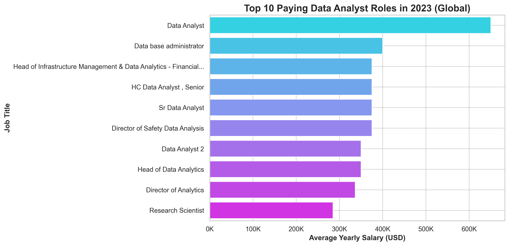
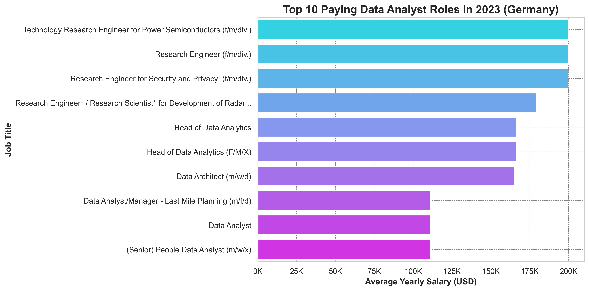
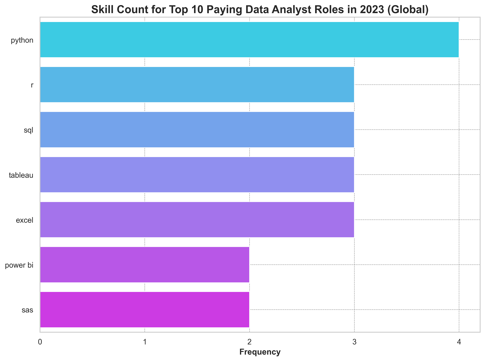
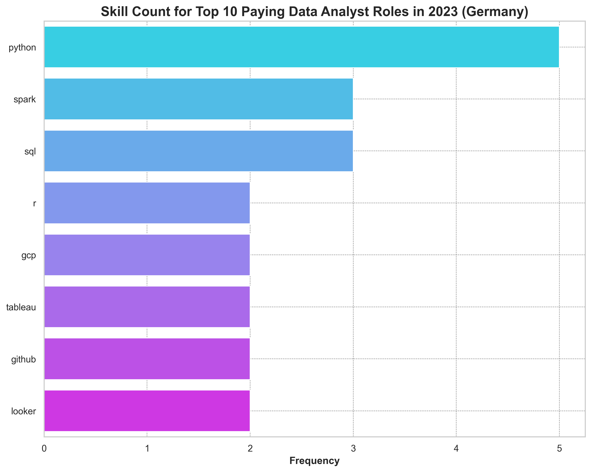
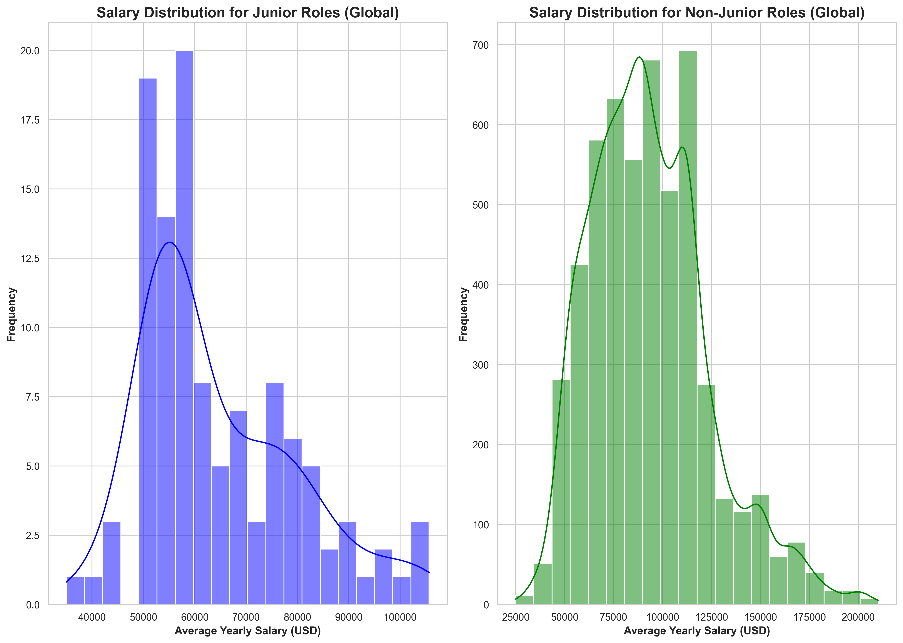
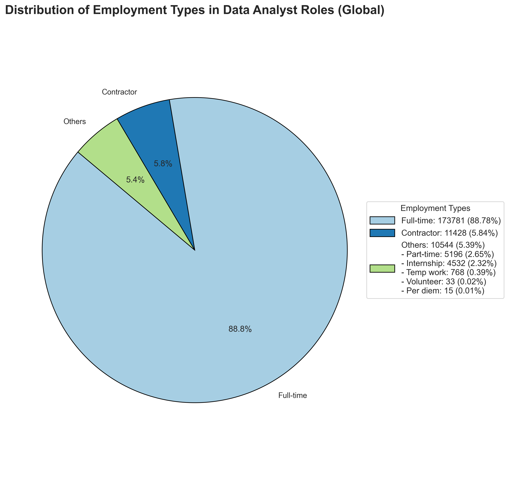
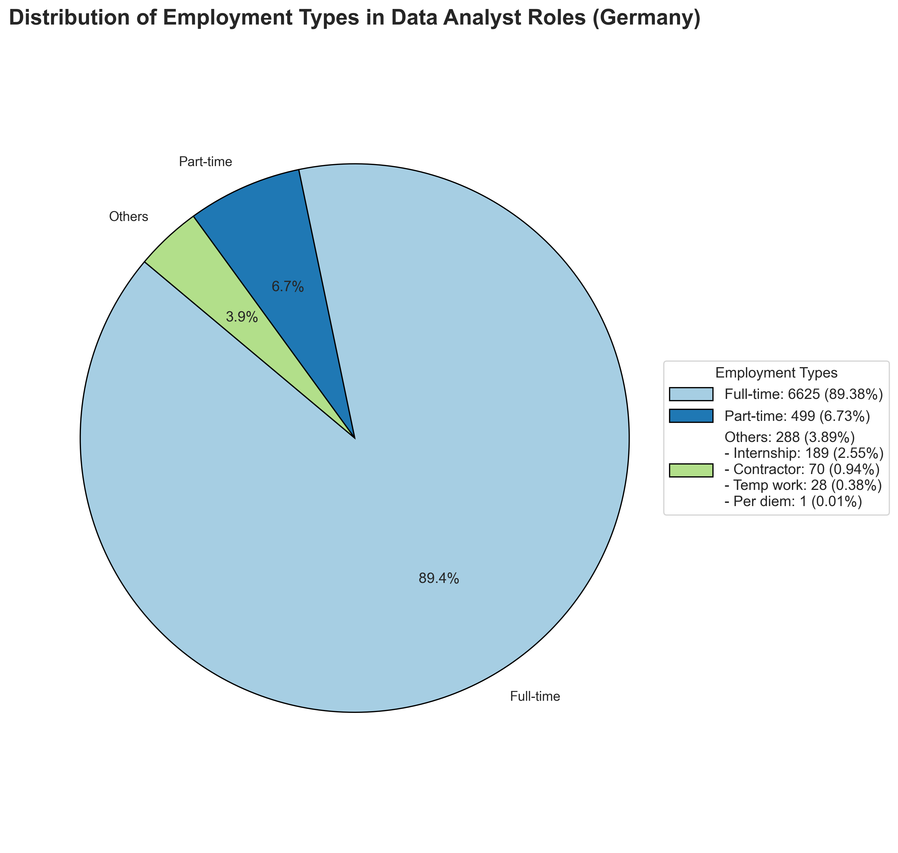
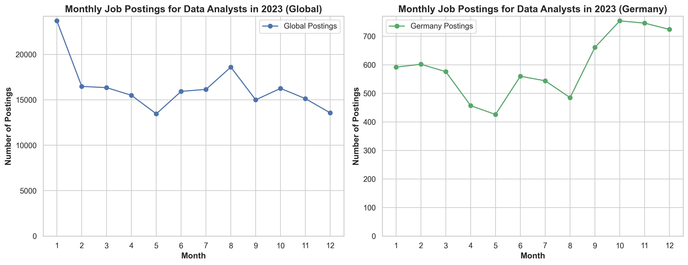

# Project About Data Analysis Jobs

German version: [Deutsche Version hier](README_in_German.md)

# Introduction
📊 Explore the global and German data job market! This project dives into data analyst roles, highlighting 💰 top-paying jobs, 🔥 in-demand skills, 📈 skills linked to higher salaries, and 📚 the best skills to learn. We also cover 🎓 degree requirements, 👩‍💻 junior positions and internships, 🧑‍💻🏢 common employment types, and 🌍 remote work opportunities. Finally, we examine 📅 when data analyst job postings peak, offering a comprehensive overview of the field.

🔍 SQL queries? Check them out here: [sql_queries Folder](/sql_queries/)

📊 Data visualization in Python? Find here: [code_for_visualizations](/code_for_visualizations.ipynb/)

# Background

**Choosing the right degree, finding an internship,** or **searching for your first role in data analytics** can be both exciting and challenging. In this analysis, I aim to **assist beginners** like myself in navigating the job market by offering useful **insights about global and German data analyst job market**.

This project uses **data from Luke Barousse's** [SQL Course](https://lukebarousse.com/sql), which collects job postings for Data Science roles globally in 2023. It provides insights into job titles, salaries, locations, key skills, and other employment-related factors.

### The questions I wanted to answer through my SQL queries were::

1. [What are the top-paying data analyst jobs? 💸🌍](#1-top-paying-data-analyst-jobs) 
2. [What skills are required for these top-paying jobs? 🎓💼](#2-skills-for-top-paying-jobs)  
3. [What skills are most in demand for data analysts? 🔧🌍](#3-in-demand-skills-for-data-analysts)  
4. [Which skills are associated with higher salaries? 💰🔑](#4-skills-based-on-salary)  
5. [What are the most optimal skills to learn? 📚💡](#5-most-optimal-skills-to-learn)  
6. [Is a degree required for data analyst roles? 🎓🤔](#6-is-a-degree-required-for-data-analyst-roles)  
7. [How many junior positions and internships are available, and what is their pay? 🎓🧑‍💻](#7-how-many-junior-positions-and-internships-are-available-and-what-is-their-pay)  
8. [What are the most common employment types in data analysis? 🧑‍💻📍](#8-what-are-the-most-common-employment-types-in-data-analysis)  
9. [How common are remote and work-from-home job offers in data analysis? 🌍](#9-how-common-are-remote-and-work-from-home-job-offers-in-data-analysis)   
10. [When are data analyst job postings most frequent? 📅📈](#10-when-are-data-analyst-job-postings-most-frequent)  

# Tools I Used
For my deep dive into the data analyst job market, I harnessed the power of several key tools:

- **SQL:** The backbone of my analysis, allowing me to query the database and unearth critical insights.
- **PostgreSQL:** The chosen database management system, ideal for handling the job posting data.
- **Visual Studio Code:** My go-to for database management and executing SQL queries.
- **Git & GitHub:** Essential for version control and sharing my SQL scripts and analysis, ensuring collaboration and project tracking.
- **Python & Jupyter Notebook:**  For telling my data story through engaging and quickly created visuals.
- **ChatGPT (Plus Subscription):** Acted as a Data Analysis Copilot, guiding project stages, assisting with repetitive tasks like formatting, and helping make data-driven inferences.

# The Analysis
Each query for this project aimed at investigating specific aspects of the data analyst job market. Here’s how I approached each question:

### 1. Top Paying Data Analyst Jobs

To identify the highest-paying roles 💰, I filtered data analyst positions by average yearly salary 📅 and location 🌍, focusing on jobs globally and in Germany. While analyzing the global market, I selected all countries, including Germany, to gain a comprehensive view of global trends. This query highlights the high-paying opportunities in the field.

```sql
-- Top-paying roles globally with distinct titles

WITH RankedJobs AS (
    SELECT
        job_id,
        job_title,
        job_location,
        job_country,
        job_schedule_type,
        salary_year_avg,
        job_posted_date,
        company_dim.name AS company_name,
        ROW_NUMBER() OVER (PARTITION BY job_title ORDER BY salary_year_avg DESC) AS row_num
    FROM
        job_postings_fact
    LEFT JOIN company_dim 
        ON job_postings_fact.company_id = company_dim.company_id
    WHERE
        job_title_short = 'Data Analyst'
        AND salary_year_avg IS NOT NULL
)

SELECT
    job_id,
    CASE
        WHEN row_num > 1 THEN CONCAT(job_title, ' ', row_num) 
        ELSE job_title
    END AS new_job_title, -- Renaming entries with the same title
    job_location,
    job_country,
    job_schedule_type,
    salary_year_avg,
    job_posted_date,
    company_name
FROM RankedJobs
ORDER BY salary_year_avg DESC
LIMIT 10;

-- Top-paying roles in Germany with distinct titles

WITH RankedJobsGermany AS (
    SELECT
        job_id,
        job_title,
        job_location,
        job_country,
        job_schedule_type,
        salary_year_avg,
        job_posted_date,
        company_dim.name AS company_name,
        ROW_NUMBER() OVER (PARTITION BY job_title ORDER BY salary_year_avg DESC) AS row_num
    FROM
        job_postings_fact
    LEFT JOIN company_dim 
        ON job_postings_fact.company_id = company_dim.company_id
    WHERE
        job_title_short = 'Data Analyst'
        AND salary_year_avg IS NOT NULL
        AND job_country = 'Germany'
)

SELECT
    job_id,
    CASE
        WHEN row_num > 1 THEN CONCAT(job_title, ' ', row_num) 
        ELSE job_title
    END AS new_job_title, -- Renaming entries with the same title
    job_location,
    job_country,
    job_schedule_type,
    salary_year_avg,
    job_posted_date,
    company_name
FROM RankedJobsGermany
ORDER BY salary_year_avg DESC
LIMIT 10;
```

*Bar graphs illustrating the top 10 highest-paying data analyst roles in 2023, both globally and in Germany, along with their respective salaries:*





Here's the breakdown of the top data analyst jobs in 2023 globally and in Germany:

**Global Market:**
- **Salary Range**: Roles range from **$285,000** to **$650,000**, with high-paying positions in tech and finance.
- **Senior Roles**: High demand for senior leadership positions, with employers like **Citigroup** and **Meta** offering top salaries.

**Germany:**
- **Salary Range**: Roles range from **$111,175** to **$200,000**, with top employers like **Bosch** and **Fraunhofer-Gesellschaft**.
- **Leadership Focus**: Strong demand for leadership roles like **Head of Data Analytics**.

**Global vs. Germany Comparison**
- **Salary Difference**: Global salaries are significantly higher, with global roles reaching **$650,000** vs. **$200,000** in Germany.
- **Role Specialization**: Global market leans toward senior leadership, while Germany focuses more on specialized engineering and tech roles.

### 2. Skills for Top Paying Jobs

Let's dive deeper into the top 10 highest-paying data analyst jobs from the previous query 🔍💼 and identify the top skills in demand for those roles. 📊 Knowing these skills will help job seekers 🎯 focus on what to develop to align with high-paying opportunities 💸. The following query will help us uncover this information.

```sql
--globally, only count of skills

WITH count_top_paying_jobs_globally AS (
    SELECT	
        job_id,
        job_title_short,
        salary_year_avg
    FROM
        job_postings_fact
    WHERE
        job_title_short = 'Data Analyst' AND 
        salary_year_avg IS NOT NULL
    ORDER BY
        salary_year_avg DESC
    LIMIT 10
)

SELECT 
    skills_dim.skills,
    COUNT(*) AS skill_count  -- Counting the number of times each skill is mentioned
FROM count_top_paying_jobs_globally
INNER JOIN skills_job_dim ON count_top_paying_jobs_globally.job_id = skills_job_dim.job_id
INNER JOIN skills_dim ON skills_job_dim.skill_id = skills_dim.skill_id
GROUP BY 
    skills_dim.skills -- Grouping by skill to count occurrences
HAVING COUNT(*) > 1 -- only showing skills mentioned more than once
ORDER BY
    skill_count DESC; -- Ordering by the count of skills in descending order 

-- Germany, only count of skills

WITH top_paying_jobs_germany AS (
    SELECT	
        job_id,
        job_title,
        salary_year_avg,
        name AS company_name
    FROM
        job_postings_fact
    LEFT JOIN company_dim ON job_postings_fact.company_id = company_dim.company_id
    WHERE
        job_title_short = 'Data Analyst' AND 
        job_country = 'Germany' AND
        salary_year_avg IS NOT NULL
    ORDER BY
        salary_year_avg DESC
    LIMIT 10
)

SELECT 
    skills_dim.skills,
    COUNT(*) AS skill_count  -- Counting the number of times each skill is mentioned
FROM top_paying_jobs_germany
INNER JOIN skills_job_dim ON top_paying_jobs_germany.job_id = skills_job_dim.job_id
INNER JOIN skills_dim ON skills_job_dim.skill_id = skills_dim.skill_id
GROUP BY 
    skills_dim.skills  -- Grouping by skill to count occurrences
HAVING COUNT(*) > 1 -- only showing skills mentioned more than once
ORDER BY
    skill_count DESC;  -- Ordering by the count of skills in descending order
```

*Bar graphs visualizing the count of skills for the top 10 paying jobs for data analysts in 2023, both globally and in Germany:*




Here's the breakdown of the most demanded skills for the top 10 highest paying data analyst jobs in 2023, both globally and in Germany:

- **Python:** Most demanded skill globally (4 mentions) and in Germany (5 mentions), central to data analysis.
- **SQL:** Essential for database management and querying in both markets.
- **R, Tableau, Excel:** Highly in demand globally, while **Spark, GCP, Looker, GitHub** are more prominent in Germany.
- **Overlap:** **Python, R, SQL, and Tableau** are key skills in both markets.

### 3. In-Demand Skills for Data Analysts

This query helped identify the skills most frequently requested in job postings, directing focus to areas with high demand 🔥.

```sql
-- globally
SELECT 
    skills,
    COUNT(skills_job_dim.job_id) AS demand_count
FROM job_postings_fact
INNER JOIN skills_job_dim ON job_postings_fact.job_id = skills_job_dim.job_id
INNER JOIN skills_dim ON skills_job_dim.skill_id = skills_dim.skill_id
WHERE
    job_title_short = 'Data Analyst' 
GROUP BY
    skills
ORDER BY
    demand_count DESC
LIMIT 5;

--Germany
SELECT 
    skills,
    COUNT(skills_job_dim.job_id) AS demand_count
FROM job_postings_fact
INNER JOIN skills_job_dim ON job_postings_fact.job_id = skills_job_dim.job_id
INNER JOIN skills_dim ON skills_job_dim.skill_id = skills_dim.skill_id
WHERE
    job_title_short = 'Data Analyst' 
    AND job_country = 'Germany' 
GROUP BY
    skills
ORDER BY
    demand_count DESC
LIMIT 5;
```

*Table of the demand for the top 5 skills in data analyst job postings globally:*

| Skills    | Demand Count |
|-----------|--------------|
| SQL       | 92,628       |
| Excel     | 67,031       |
| Python    | 57,326       |
| Tableau   | 46,554       |
| Power BI  | 39,468       |


*Table of the demand for the top 5 skills in data analyst job postings in Germany:*

| Skills    | Demand Count |
|-----------|--------------|
| SQL       | 2947         |
| Python    | 2316         |
| Tableau   | 1370         |
| Excel     | 1327         |
| Power BI  | 1303         |

Here's the breakdown of the most demanded skills for data analysts in 2023 globally and in Germany:

- **SQL** is the most in-demand skill globally (92,628) and in Germany (2,947), highlighting its central role in data analysis across all markets.
- **Python** follows closely, showing a strong demand both globally (57,326) and in Germany (2,316), indicating the growing need for programming skills in data analysis.
- **Tableau** is highly sought after globally (46,554) and in Germany (1,370), reflecting the increasing importance of data visualization skills.
- **Excel** and **Power BI** are in demand globally but slightly less so in Germany, where there's a stronger emphasis on **Python** and **Tableau** for more advanced analytics.

### 4. Skills Based on Salary

Exploring the average salaries associated with different skills revealed which skills are the highest paying 💰.

```sql
-- globally
SELECT 
    skills,
    ROUND(AVG(salary_year_avg), 0) AS avg_salary
FROM job_postings_fact
INNER JOIN skills_job_dim ON job_postings_fact.job_id = skills_job_dim.job_id
INNER JOIN skills_dim ON skills_job_dim.skill_id = skills_dim.skill_id
WHERE
    job_title_short = 'Data Analyst'
    AND salary_year_avg IS NOT NULL
GROUP BY
    skills
ORDER BY
    avg_salary DESC
LIMIT 25;

-- Germany
SELECT 
    skills,
    ROUND(AVG(salary_year_avg), 0) AS avg_salary
FROM job_postings_fact
INNER JOIN skills_job_dim ON job_postings_fact.job_id = skills_job_dim.job_id
INNER JOIN skills_dim ON skills_job_dim.skill_id = skills_dim.skill_id
WHERE
    job_title_short = 'Data Analyst'
    AND job_country = 'Germany'
    AND salary_year_avg IS NOT NULL
GROUP BY
    skills
ORDER BY
    avg_salary DESC
LIMIT 25;
```

*Table of the average salary for the top 10 paying skills for data analysts globally:*
| Skills     | Average Salary ($) |
|------------|--------------------|
| SVN        | 400,000            |
| Solidity   | 179,000            |
| Couchbase  | 160,515            |
| Datarobot  | 155,486            |
| Golang     | 155,000            |
| MXNet      | 149,000            |
| Dplyr      | 147,633            |
| VMware     | 147,500            |
| Terraform  | 146,734            |
| Twilio     | 138,500            |


*Table of the average salary for the top 10 paying skills for data analysts in Germany:*
| Skills    | Average Salary ($) |
|-----------|--------------------|
| Kafka     | 166,420            |
| Terraform | 166,420            |
| BigQuery  | 166,420            |
| NoSQL     | 166,420            |
| Redshift  | 166,420            |
| GitHub    | 150,896            |
| Spark     | 138,261            |
| GCP       | 127,478            |
| No-SQL    | 111,175            |
| Terminal  | 111,175            |

Here's the breakdown of the results for top paying skills for Data Analysts globally and in Germany:

- **Global market** offers the highest-paying roles for specialized skills like **SVN** ($400,000) and **Solidity** ($179,000), indicating demand for niche technologies.
- **Germany** focuses on cloud and big data tools like **Kafka**, **Terraform**, and **BigQuery**, with average salaries of **$166,420**.
- **Global vs. Germany**: The global market values specialized, emerging technologies more, while Germany emphasizes foundational cloud and big data skills.
- **Salary Insights**: Global salaries are higher for certain specialized skills, but Germany’s salaries align around **$166,420** for top-demand skills.

### 5. Most Optimal Skills to Learn

Combining insights from demand and salary data, this query aimed to pinpoint skills that are both in high demand 🔥 and have high salaries 📈, offering a strategic focus for skill development.

```sql
--globally
SELECT 
    skills_dim.skill_id,
    skills_dim.skills,
    COUNT(skills_job_dim.job_id) AS demand_count,
    ROUND(AVG(job_postings_fact.salary_year_avg), 0) AS avg_salary
FROM job_postings_fact
INNER JOIN skills_job_dim ON job_postings_fact.job_id = skills_job_dim.job_id
INNER JOIN skills_dim ON skills_job_dim.skill_id = skills_dim.skill_id
WHERE
    job_title_short = 'Data Analyst'
    AND salary_year_avg IS NOT NULL
GROUP BY
    skills_dim.skill_id
HAVING
    COUNT(skills_job_dim.job_id) > 10
ORDER BY
    avg_salary DESC,
    demand_count DESC
LIMIT 25;

--Germany
SELECT 
    skills_dim.skill_id,
    skills_dim.skills,
    COUNT(skills_job_dim.job_id) AS demand_count,
    ROUND(AVG(job_postings_fact.salary_year_avg), 0) AS avg_salary
FROM job_postings_fact
INNER JOIN skills_job_dim ON job_postings_fact.job_id = skills_job_dim.job_id
INNER JOIN skills_dim ON skills_job_dim.skill_id = skills_dim.skill_id
WHERE
    job_title_short = 'Data Analyst'
    AND salary_year_avg IS NOT NULL
    AND job_country = 'Germany' 
GROUP BY
    skills_dim.skill_id
HAVING
    COUNT(skills_job_dim.job_id) > 5
ORDER BY
    avg_salary DESC,
    demand_count DESC
LIMIT 25;
```

*Table of the most optimal skills for data analyst globally sorted by salary:*

| Skill ID | Skills    | Demand Count | Average Salary ($) |
|----------|-----------|--------------|--------------------|
| 98       | Kafka     | 40           | 129,999            |
| 101      | Pytorch   | 20           | 125,226            |
| 31       | Perl      | 20           | 124,686            |
| 99       | TensorFlow| 24           | 120,647            |
| 63       | Cassandra | 11           | 118,407            |
| 219      | Atlassian | 15           | 117,966            |
| 96       | Airflow   | 71           | 116,387            |
| 3        | Scala     | 59           | 115,480            |
| 169      | Linux     | 58           | 114,883            |
| 234      | Confluence| 62           | 114,153            |

*Table of the most optimal skills for data analyst in Germany sorted by salary:*

| Skill ID | Skills | Demand Count | Average Salary ($) |
|----------|--------|--------------|--------------------|
| 92       | Spark  | 7            | 138,261            |
| 1        | Python | 18           | 104,243            |
| 182      | Tableau| 13           | 97,211             |
| 0        | SQL    | 24           | 93,688             |
| 181      | Excel  | 7            | 87,623             |
| 5        | R      | 7            | 81,862             |

Here's the breakdown of the most optimal skills for Data Analysts in 2023:

**Globally:**
- **Kafka** (40 mentions) and **Solidity** (20 mentions) lead in **real-time data processing and blockchain roles**, with high salaries ($129,999 and $179,000, respectively).
- **AI/ML Demand:** Pytorch (20 mentions) and TensorFlow (24 mentions) reflect strong demand for AI skills, with salaries of $125,226 and $120,647.
- **Big Data & Cloud**: Snowflake (241 mentions) and Databricks (102 mentions) are key in big data and cloud computing, with average salaries around $111,578 and $112,881.

**Germany:** 
- **SQL** (24 mentions) and **Python** (18 mentions) dominate with salaries of $93,688 and $104,243, while **Spark** (7 mentions) offers high pay but lower demand.

### 6. Is a degree required for data analyst roles? 

This query continues to guide data analytics enthusiasts through the job market by calculating the number and percentage of Data Analyst job postings that don’t mention a degree 🎓, both globally and in Germany, helping job seekers decide whether to focus on obtaining a degree or enhancing practical skills 👩‍💻.

```sql
SELECT
    -- Global market (no degree mentioned)
    COUNT(CASE WHEN job_no_degree_mention = TRUE THEN 1 END) AS no_degree_required_count_global,
    -- Total postings globally
    COUNT(*) AS total_postings_global,
    -- Percentage of job postings with no degree mentioned globally
    ROUND(
        (COUNT(CASE WHEN job_no_degree_mention = TRUE THEN 1 END) * 100.0) / COUNT(*), 
        0
    ) AS percentage_no_degree_global,

    -- Germany market (no degree mentioned)
    COUNT(CASE WHEN job_country = 'Germany' AND job_no_degree_mention = TRUE THEN 1 END) AS no_degree_required_count_germany,
    -- Total postings in Germany
    COUNT(CASE WHEN job_country = 'Germany' THEN 1 END) AS total_postings_germany,
    -- Percentage of job postings with no degree mentioned in Germany
    ROUND(
        (COUNT(CASE WHEN job_country = 'Germany' AND job_no_degree_mention = TRUE THEN 1 END) * 100.0) / COUNT(CASE WHEN job_country = 'Germany' THEN 1 END), 
        0
    ) AS percentage_no_degree_germany
FROM job_postings_fact
WHERE job_title_short = 'Data Analyst';
```

*Table showing the number and percentage of Data Analyst job postings that do not mention a degree, both globally and in Germany:*

| Market           | Job Postings Without Degree | Total Job Postings | Percentage Without Degree |
|------------------|-----------------------------|--------------------|---------------------------|
| Global           | 76,057                      | 196,593            | 39%                       |
| Germany          | 4,894                       | 7,141              | 69%                       |

Here's the breakdown of how many job postings for Data Analysts mentioned the degree in 2023 globally and in Germany: 

- **Global Market:** While 39% of Data Analyst roles globally do not mention a degree, this may not necessarily mean it's not required. Around 60% of job postings still reference a degree requirement.
- **Germany:** Approximately 69% of Data Analyst roles in Germany do not mention a degree, but this doesn't guarantee that it’s not a factor. Around 40% of job postings still mention a degree requirement.
- **Implication:** Job seekers may still find many opportunities without a degree, especially in Germany, but it's important to consider that degree requirements may still apply even if not explicitly mentioned in the postings.

### 7. How many junior positions and internships are available, and what is their pay? 

By analyzing junior positions and internships 👩‍💻, this query helps aspiring analysts assess entry-level opportunities and pay trends globally and in Germany. 

```sql
-- counting junior positions, internships and their percentage (with NULL values in salary_year_avg column)

SELECT
    -- Global market (junior postings)
    COUNT(CASE WHEN job_title LIKE '%Junior%' THEN 1 END) AS junior_postings_count_global,
    -- Total postings globally
    COUNT(*) AS total_postings_global,
    -- Percentage of junior job postings globally
    ROUND(
        (COUNT(CASE WHEN job_title LIKE '%Junior%' THEN 1 END) * 100.0) / COUNT(*), 
        0
    ) AS percentage_junior_roles_global,

    -- Global market (internships)
    COUNT(CASE WHEN job_schedule_type LIKE '%Internship%' THEN 1 END) AS internships_count_global,
    -- Percentage of internships postings globally
    ROUND(
        (COUNT(CASE WHEN job_schedule_type LIKE '%Internship%' THEN 1 END) * 100.0) / COUNT(*), 
        0
    ) AS percentage_internships_global,

    -- Germany market (junior postings)
    COUNT(CASE WHEN job_country = 'Germany' AND job_title LIKE '%Junior%' THEN 1 END) AS junior_postings_count_germany,
    -- Total postings in Germany
    COUNT(CASE WHEN job_country = 'Germany' THEN 1 END) AS total_postings_germany,
    -- Percentage of junior job postings in Germany
    ROUND(
        (COUNT(CASE WHEN job_country = 'Germany' AND job_title LIKE '%Junior%' 
            THEN 1 END) * 100.0) / COUNT(CASE WHEN job_country = 'Germany' THEN 1 END), 
        0
    ) AS percentage_junior_roles_germany,

    -- Germany market (internships)
    COUNT(CASE WHEN job_country = 'Germany' AND job_schedule_type LIKE '%Internship%' THEN 1 END) AS internships_count_germany,
    -- Percentage of internships postings in Germany
    ROUND(
        (COUNT(CASE WHEN job_country = 'Germany' AND job_schedule_type LIKE '%Internship%' 
            THEN 1 END) * 100.0) / COUNT(CASE WHEN job_country = 'Germany' THEN 1 END), 
        0
    ) AS percentage_internships_germany
FROM job_postings_fact
WHERE job_title_short = 'Data Analyst';

/* counting junior positions, internships and their percentage (without NULL values in salary_year_avg column); 
results of this query indicate that only further analysis of the salaries of junior vs non-junior data analyst roles in the global market is representative, due to the sufficient size of the dataset
*/

SELECT
    -- Global market (junior postings)
    COUNT(CASE WHEN job_title LIKE '%Junior%' THEN 1 END) AS junior_postings_count_global,
    -- Total postings globally
    COUNT(*) AS total_postings_global,
    -- Percentage of junior job postings globally
    ROUND(
        (COUNT(CASE WHEN job_title LIKE '%Junior%' THEN 1 END) * 100.0) / COUNT(*), 
        0
    ) AS percentage_junior_roles_global,

    -- Global market (internships)
    COUNT(CASE WHEN job_schedule_type LIKE '%Internship%' THEN 1 END) AS internships_count_global,
    -- Percentage of internships postings globally
    ROUND(
        (COUNT(CASE WHEN job_schedule_type LIKE '%Internship%' THEN 1 END) * 100.0) / COUNT(*), 
        2
    ) AS percentage_internships_global,

    -- Germany market (junior postings)
    COUNT(CASE WHEN job_country = 'Germany' AND job_title LIKE '%Junior%' THEN 1 END) AS junior_postings_count_germany,
    -- Total postings in Germany
    COUNT(CASE WHEN job_country = 'Germany' THEN 1 END) AS total_postings_germany,
    -- Percentage of junior job postings in Germany
    ROUND(
        (COUNT(CASE WHEN job_country = 'Germany' AND job_title LIKE '%Junior%' 
            THEN 1 END) * 100.0) / COUNT(CASE WHEN job_country = 'Germany' THEN 1 END), 
        0
    ) AS percentage_junior_roles_germany,

    -- Germany market (internships)
    COUNT(CASE WHEN job_country = 'Germany' AND job_schedule_type LIKE '%Internship%' THEN 1 END) AS internships_count_germany,
    -- Percentage of internships postings in Germany
    ROUND(
        (COUNT(CASE WHEN job_country = 'Germany' AND job_schedule_type LIKE '%Internship%' 
            THEN 1 END) * 100.0) / COUNT(CASE WHEN job_country = 'Germany' THEN 1 END), 
        2
    ) AS percentage_internships_germany
FROM job_postings_fact
WHERE job_title_short = 'Data Analyst' 
AND salary_year_avg IS NOT NULL;

-- Query to calculate the median salary for Junior and Non-Junior roles, analyzing only the global market

WITH JuniorSalaries AS (
    SELECT salary_year_avg,
           ROW_NUMBER() OVER (ORDER BY salary_year_avg) AS row_num,
           COUNT(*) OVER () AS total_count
    FROM job_postings_fact
    WHERE job_title_short = 'Data Analyst' 
      AND job_title LIKE '%Junior%' 
      AND salary_year_avg IS NOT NULL
),
NonJuniorSalaries AS (
    SELECT salary_year_avg,
           ROW_NUMBER() OVER (ORDER BY salary_year_avg) AS row_num,
           COUNT(*) OVER () AS total_count
    FROM job_postings_fact
    WHERE job_title_short = 'Data Analyst' 
      AND job_title NOT LIKE '%Junior%' 
      AND salary_year_avg IS NOT NULL
)
SELECT 
    'Junior' AS job_type,
    ROUND(AVG(salary_year_avg), 0) AS median_salary  -- Round to zero decimal places
FROM JuniorSalaries
WHERE row_num IN (
    SELECT FLOOR((total_count + 1) / 2)
    UNION ALL
    SELECT FLOOR(total_count / 2)
    UNION ALL
    SELECT FLOOR(total_count / 2) + 1
)
UNION ALL
SELECT 
    'Non-Junior' AS job_type,
    ROUND(AVG(salary_year_avg), 0) AS median_salary  -- Round to zero decimal places
FROM NonJuniorSalaries
WHERE row_num IN (
    SELECT FLOOR((total_count + 1) / 2)
    UNION ALL
    SELECT FLOOR(total_count / 2)
    UNION ALL
    SELECT FLOOR(total_count / 2) + 1
);

/* Preparing the data for cleaning (removing outliers) and for creating the salary distribution of Junior vs Non-Junior Data Analyst job postings in Python */

SELECT
    'Junior' AS job_type,
    salary_year_avg
FROM job_postings_fact
WHERE job_title LIKE '%Junior%' 
    AND job_title_short = 'Data Analyst' 
    AND salary_year_avg IS NOT NULL
ORDER BY salary_year_avg DESC;

SELECT
    'Non-Junior' AS job_type,
    salary_year_avg
FROM job_postings_fact
WHERE job_title_short = 'Data Analyst' 
    AND job_title NOT LIKE '%Junior%' 
    AND salary_year_avg IS NOT NULL
ORDER BY salary_year_avg DESC;
```

```python
# Using Interquartile Range (IQR) to Detect Outliers

import pandas as pd
import seaborn as sns
import matplotlib.pyplot as plt

# Load the datasets for junior and non-junior roles globally
junior_df = pd.read_csv('C:\\Users\\Lenovo\\Downloads\\7_junior_postings_global.csv')
non_junior_df = pd.read_csv('C:\\Users\\Lenovo\\Downloads\\7_nonjunior_postings_global.csv')

# Function to remove outliers based on IQR method
def remove_outliers(df, role_type):
    # Calculate Q1 (25th percentile) and Q3 (75th percentile)
    Q1 = df['salary_year_avg'].quantile(0.25)
    Q3 = df['salary_year_avg'].quantile(0.75)
    
    # Calculate IQR (Interquartile Range)
    IQR = Q3 - Q1
    
    # Set multiplier based on role type
    if role_type == 'junior':
        multiplier = 1.5  # Standard multiplier for junior roles
    else:
        multiplier = 2.5  # Adjusted multiplier for non-junior roles
    
    # Define the upper and lower bounds
    lower_bound = Q1 - multiplier * IQR
    upper_bound = Q3 + multiplier * IQR
    
    # Filter the dataframe to remove outliers
    filtered_df = df[(df['salary_year_avg'] >= lower_bound) & (df['salary_year_avg'] <= upper_bound)]
    
    return filtered_df

# Remove outliers for junior roles (using 1.5 multiplier)
junior_df_cleaned = remove_outliers(junior_df, 'junior')

# Remove outliers for non-junior roles (using 2.5 multiplier)
non_junior_df_cleaned = remove_outliers(non_junior_df, 'non-junior')

# Add the 'job_type' column for both datasets
junior_df_cleaned['job_type'] = 'Junior'
non_junior_df_cleaned['job_type'] = 'Non-Junior'

# Plotting two separate histograms for Junior and Non-Junior roles
plt.figure(figsize=(14, 10))

# Histogram for Junior Roles
plt.subplot(1, 2, 1)  # 1 row, 2 columns, 1st subplot
sns.histplot(junior_df_cleaned['salary_year_avg'], kde=True, color='blue', bins=20)
plt.title('Salary Distribution for Junior Roles (Cleaned)', fontsize=16)
plt.xlabel('Average Yearly Salary (USD)', fontsize=12)
plt.ylabel('Frequency', fontsize=12)

# Histogram for Non-Junior Roles
plt.subplot(1, 2, 2)  # 1 row, 2 columns, 2nd subplot
sns.histplot(non_junior_df_cleaned['salary_year_avg'], kde=True, color='green', bins=20)
plt.title('Salary Distribution for Non-Junior Roles (Cleaned)', fontsize=16)
plt.xlabel('Average Yearly Salary (USD)', fontsize=12)
plt.ylabel('Frequency', fontsize=12)

# Show the plot
plt.tight_layout()
plt.savefig('07_salary_distribution_cleaned.png', dpi=300, bbox_inches='tight', facecolor='white')
plt.show()
```

*Table presenting the number of junior roles and internships in data analysis and their percentage in 2023 globally and in Germany:*

| Metric                           | Global Market       | Germany Market      |
|----------------------------------|---------------------|---------------------|
| **Total Postings**               | 196,593             | 7,141               |
| **Junior Postings Count**        | 5,755               | 396                 |
| **Percentage of Junior Postings**   | 3%                  | 6%                  |
| **Internships Count**            | 4,532               | 189                 |
| **Percentage of Internships**    | 2%                  | 3%                  |

*Table showing the median yearly salary for junior and non-junior data analyst roles in 2023 globally:*

| Job Type    | Median Salary (USD) |
|-------------|---------------------|
| Junior      | $57,500             |
| Non-Junior  | $90,000             |

*Histograms showing salary distribution of Junior vs Non-Junior Data Analyst job postings in 2023 globally:*

 


Here’s the breakdown of the number of junior positions, internships, and their corresponding pay:

**Global Market**: 
- **3%** of job postings are for junior data analysts, and **2%** are internships; 
- **over 99% of internships globally** have NULL salary values, making the analysis of internship salaries unrepresentative.

**Germany**: 
- **6%** of job postings in Germany are junior roles, and **3%** are internships; 
- no internship postings in Germany had salary data, making salary analysis for internships not possible.

**Salary Analysis**: 
- Only the analysis of **Junior vs Non-junior salaries globally** is representative. The median salary for junior data analysts globally is **$57,500**, while non-junior roles have a higher median salary of **$90,000**, indicating a clear **salary gap**.
- Based on the histograms, **Junior roles** have a salary range mainly between $40,000 and $80,000, peaking around **$50,000-$60,000**, indicating concentration in lower salary brackets.
- **Non-Junior roles** span a wider range from $25,000 to over $200,000, with a concentration around **$60,000-$120,000**, reflecting higher and more varied salary offerings.

### 8. What are the most common employment types in data analysis? 

This query reveals the most common employment types 🧑‍💻🏢 (e.g., full-time, part-time, contract), helping job seekers choose the best fit for their career and lifestyle. 

```sql 
-- Preparing the dataset of employment types in the global and German data analysis job markets for further use in NLP analysis

-- global
SELECT job_schedule_type
FROM job_postings_fact
WHERE job_title_short = 'Data Analyst' 
AND job_schedule_type IS NOT NULL;

-- Germany
SELECT job_schedule_type
FROM job_postings_fact
WHERE job_title_short = 'Data Analyst' 
AND job_schedule_type IS NOT NULL
AND job_country = 'Germany';
```
The following code is for global market analysis only; see the [code_for_visualizations](/code_for_visualizations.ipynb) for the Germany market analysis.

```python 
import pandas as pd
from collections import Counter
import matplotlib.pyplot as plt
import re

# Load the dataset for global market
df_global = pd.read_csv('C:\\Users\\Lenovo\\Downloads\\08_employment_type_global.csv')

# Drop rows where 'job_schedule_type' is NaN
df_global = df_global.dropna(subset=['job_schedule_type'])

# Step 1: Drop "Pekerjaan tetap" rows
df_global = df_global[df_global['job_schedule_type'] != 'Pekerjaan tetap']

# Step 2: Define multi-word phrases to replace with placeholders
multi_word_phrases = ['Temp work', 'Per diem']

# Step 3: Replace multi-word phrases with placeholders to avoid splitting
df_global['job_schedule_type'] = df_global['job_schedule_type'].replace({
    'Temp work': 'TEMP_WORK',
    'Per diem': 'PER_DIEM'
}, regex=False)

# Step 4: Split job schedule types by 'and', ', ', and ', and' and count individual components
individual_components_global = []

# Iterate over job schedule types and split by the specified delimiters
for schedule in df_global['job_schedule_type'].dropna():
    components_global = re.split(r'\s*(?:, and|and|,)\s*', schedule)  # Split by 'and', ', and' or ', '
    individual_components_global.extend(components_global)

# Step 5: Count the occurrences of each component
component_counts_global = Counter(individual_components_global)

# Step 6: Replace placeholders back with the correct multi-word phrases
component_counts_global = {key.replace('TEMP_WORK', 'Temp work').replace('PER_DIEM', 'Per diem'): value 
                           for key, value in component_counts_global.items()}

# Step 7: Calculate the total frequency for global market
total_frequency_global = sum(component_counts_global.values())

# Step 8: Group job types that take up less than 5% into "Others" for global market
grouped_counts_global = {}
others_count_global = 0
others_details_global = []

# Identify components that should be grouped into "Others"
for job_type, count in component_counts_global.items():
    percentage = (count / total_frequency_global) * 100
    if percentage < 5:
        others_count_global += count
        others_details_global.append((job_type, count, percentage))  # Store as tuple with percentage for sorting
    else:
        grouped_counts_global[job_type] = count

# Sort "Others" components by frequency in descending order
others_details_global.sort(key=lambda x: x[1], reverse=True)  # Sort by count (index 1)

# Add the "Others" category to the grouped_counts
if others_count_global > 0:
    grouped_counts_global['Others'] = others_count_global

# Step 9: Create a DataFrame for better visualization for global market
component_df_global = pd.DataFrame(component_counts_global.items(), columns=['Job Schedule Type', 'Frequency'])
component_df_global = component_df_global.sort_values(by='Frequency', ascending=False)

updated_component_df_global = pd.DataFrame(grouped_counts_global.items(), columns=['Job Schedule Type', 'Frequency'])
updated_component_df_global = updated_component_df_global.sort_values(by='Frequency', ascending=False)

# Calculate the percentage for each job schedule type in the original and updated table for global market
component_df_global['Percentage'] = (component_df_global['Frequency'] / component_df_global['Frequency'].sum()) * 100
component_df_global['Percentage'] = component_df_global['Percentage'].round(2)  # Ensure 2 decimals

updated_component_df_global['Percentage'] = (updated_component_df_global['Frequency'] / updated_component_df_global['Frequency'].sum()) * 100
updated_component_df_global['Percentage'] = updated_component_df_global['Percentage'].round(2)  # Ensure 2 decimals

# Display the result as a table for global market
print("Frequency of Job Schedule Types (Global)")
print(component_df_global)

# Display the result as an updated table for global market
print("Updated Frequency of Job Schedule Types (Global)")
print(updated_component_df_global)

# Step 10: Plot the results as a Pie Chart for global market
plt.figure(figsize=(10, 10))

# Pie chart for the grouped data (global market)
plt.pie(updated_component_df_global['Frequency'], labels=updated_component_df_global['Job Schedule Type'], autopct='%1.1f%%', startangle=140, 
        colors=plt.cm.Paired.colors, wedgeprops={'edgecolor': 'black'})

# Add title for global market
plt.title('Distribution of Employment Types in Data Analyst Roles (Global)', fontsize=18, fontweight="bold")

# Add a dynamic legend for the "Others" category with detailed breakdown for global market
others_legend_global = "\n".join([f'- {job_type}: {count} ({percentage:.2f}%)' for job_type, count, percentage in others_details_global])
labels_global = [
    f'{key}: {value} ({value/total_frequency_global*100:.2f}%)' 
    for key, value in component_counts_global.items() if (value / total_frequency_global) * 100 >= 5
] + [f'Others: {others_count_global} ({others_count_global/total_frequency_global*100:.2f}%)\n{others_legend_global}']

# Create the legend with improved readability for "Others" for global market
plt.legend(labels_global, loc='center left', bbox_to_anchor=(1, 0.5), title="Employment Types", fontsize=12, handlelength=3, handleheight=1)

# Display the pie chart
plt.axis('equal')  # Equal aspect ratio ensures that pie is drawn as a circle.
plt.tight_layout()

# Save the plot for global market
plt.savefig('08_employment_type_globally.png', dpi=300, bbox_inches='tight', facecolor='white')

# Show the plot
plt.show()
```
*Pie charts showing the breakdown of employment types in data analysis job postings globally and in Germany:*




Here's the breakdown of the most common employment types in data analysis job postings in 2023:

- **Full-time positions** dominate both global (88.78%) and German (89.38%) data analyst job markets.
- **Contractor roles** are more common globally (5.84%) than in Germany (0.94%).
- **Part-time positions** are more prevalent in Germany (6.73%) than globally (2.65%).
- **Internships** are common among smaller categories, with 2.32% globally and 2.55% in Germany.

### 9. How common are remote and work-from-home job offers in data analysis?

This query shows the prevalence of remote work and work-from-home 👩‍💻 in data analysis jobs, helping analysts determine if they should target remote opportunities. 

```sql
/* The following queries, which search for job postings with remote work and work-form-home options, show that job postings labeled as "Anywhere" (remote work) are identical to those labeled as "work-form-home." Therefore, only "remote work" is analyzed further, as it encompasses "work-form-home" roles.
*/

-- globally
WITH query1 AS (
    SELECT job_id, job_title, salary_year_avg
    FROM job_postings_fact
    WHERE job_location = 'Anywhere'
    AND job_title_short = 'Data Analyst'
),
query2 AS (
    SELECT job_id, job_title, salary_year_avg
    FROM job_postings_fact
    WHERE job_work_from_home IS TRUE
    AND job_title_short = 'Data Analyst'
)
SELECT 
    q1.job_id, 
    q1.job_title, 
    q1.salary_year_avg AS salary_year_avg_q1,
    q2.salary_year_avg AS salary_year_avg_q2
FROM query1 q1
FULL OUTER JOIN query2 q2
    ON q1.job_id = q2.job_id
ORDER BY q1.job_id;

-- Germany
WITH query1 AS (
    SELECT job_id, job_title, salary_year_avg
    FROM job_postings_fact
    WHERE job_location = 'Anywhere'
    AND job_title_short = 'Data Analyst'
    AND job_country = 'Germany'
),
query2 AS (
    SELECT job_id, job_title, salary_year_avg
    FROM job_postings_fact
    WHERE job_work_from_home IS TRUE
    AND job_title_short = 'Data Analyst'
    AND job_country = 'Germany'
)
SELECT 
    q1.job_id, 
    q1.job_title, 
    q1.salary_year_avg AS salary_year_avg_q1,
    q2.salary_year_avg AS salary_year_avg_q2
FROM query1 q1
FULL OUTER JOIN query2 q2
    ON q1.job_id = q2.job_id
ORDER BY q1.job_id;

-- Calculating how frequently remote work and work-from-home are offered globally and in Germany

SELECT
    -- Global market (remote)
    COUNT(CASE WHEN job_location = 'Anywhere' THEN 1 END) AS remote_count_global,
    -- Total postings globally
    COUNT(*) AS total_postings_global,
    -- Percentage of remote job postings globally
    ROUND(
        (COUNT(CASE WHEN job_location = 'Anywhere' THEN 1 END) * 100.0) / COUNT(*), 
        0
    ) AS percentage_remote_global,

    -- Germany market (remote)
    COUNT(CASE WHEN job_country = 'Germany' AND job_location = 'Anywhere' THEN 1 END) AS remote_count_germany,
    -- Total postings in Germany
    COUNT(CASE WHEN job_country = 'Germany' THEN 1 END) AS total_postings_germany,
    -- Percentage of remote job postings in Germany
    ROUND(
        (COUNT(CASE WHEN job_country = 'Germany' AND job_location = 'Anywhere' THEN 1 END) * 100.0) / COUNT(CASE WHEN job_country = 'Germany' THEN 1 END), 
        0
    ) AS percentage_remote_germany
FROM job_postings_fact
WHERE job_title_short = 'Data Analyst';
```
*Table showing the number of remote and work-from-home offers in data analysis and their percentage in 2023, both globally and in Germany:*

| **Region**    | **Remote Count** | **Total Postings** | **Percentage Remote** |
|---------------|------------------|--------------------|-----------------------|
| Global        | 13,331           | 196,593            | 7%                    |
| Germany       | 274              | 7,141              | 4%                    |

Here is the breakdown of the prevalence of remote and work-from-home job offers:

- Remote and work-from-home job offers in data analysis are **more prevalent globally (7%)** compared to **Germany (4%)**.

### 10. When are data analyst job postings most frequent? 

This query shows when data analyst job postings peak, helping job seekers time their applications for maximum impact.

```sql
SELECT 
    EXTRACT(MONTH FROM job_posted_date) AS month,
    COUNT(CASE WHEN job_country = 'Germany' THEN job_id END) AS number_of_postings_germany,
    COUNT(job_id) AS number_of_postings_global
FROM job_postings_fact
WHERE job_title_short = 'Data Analyst'
AND EXTRACT(YEAR FROM job_posted_date) = 2023
GROUP BY month
ORDER BY month;
```
*Charts showing monthly job postings for data analysts in 2023 globally and in Germany:*



Here's the breakdown of Monthly Job Postings for Data Analysts in 2023 globally and in Germany:

- **January** stands out globally as the **highest** month for job postings, likely due to companies' increased hiring activity in the new year.
- **October** is the **peak** month in Germany, suggesting a strong push towards year-end hiring, possibly influenced by organizational needs for Q4.
- Both regions saw a notable **decline** in **December**, suggesting a common slowdown in recruitment efforts due to holidays and year-end budget cycles.

# What I Learned

Throughout this journey, I've equipped my SQL, Python, NLP, and AI prompting toolkit with powerful skills and techniques:

🧩 **Complex Query Crafting**: Mastered advanced SQL by merging tables with JOIN and using WITH clauses for Common Table Expressions (CTEs).

📊 **Data Aggregation**: Nailed `GROUP BY`, and made `COUNT()`, `AVG()`, `ROUND()`, and conditional aggregation with `CASE` my go-to tools for summarizing data.

🔢 **Sequence Generation**: Used `ROW_NUMBER()` to calculate median salary and clean job postings by renaming identical job titles for smooth visualization.

📊 **Outlier Removal**: Applied the IQR method to remove outliers, ensuring clean data for histograms.

🧩 **AI Copilot**: Mastered prompt engineering for data cleaning and visualization, with ChatGPT Plus as my trusty AI sidekick.

🧩 **Natural Language Analysis**: Worked with tokenization and splitting by delimiters while using placeholders for multi-word phrases to count text frequencies accurately.

🔄 **Dynamic Grouping & Visualization**: Grouped job types below 5% into "Others" for clearer pie charts, with a detailed breakdown in the legend, while ensuring dynamic updates for percentages and charts based on dataset changes.

💡 **Analytical Wizardry**: Transformed questions into actionable SQL queries and Python visualizations, leveling up my problem-solving skills.

# Conclusions
### Insights
From the analysis, several general insights emerged:

 1. **Top Paying Data Analyst Jobs 💸🌍**
    - **Global** roles range from **$285K to $650K**, mostly in tech and finance.
    - **Germany**: roles range from **$111K to $200K**, with a focus on leadership.


 2. **Skills for Top Paying Jobs 🎓💼**
    - **Top skills**: **Python, SQL, R, Tableau**, and **Spark** (Germany) are essential for high-paying roles.


 3. **In-Demand Skills for Data Analysts 🔧🌍**
    - **Most in-demand**: **SQL** and **Python** are central across markets.


 4. **Skills Based on Salary 💰🔑**
    - **Global**: Niche skills like **SVN** and **Solidity** pay the highest.
    - **Germany**: Big data tools like **Kafka** and **Terraform** are valued.


 5. **Most Optimal Skills to Learn 📚💡**
    - **Global**: **Kafka**, **Solidity**, and **AI/ML** tools like **Pytorch** and **TensorFlow**.
    - **Germany**: **SQL** and **Python** are the most sought-after skills, while **Spark** offers high pay but has lower demand.


 6. **Is a Degree Required for Data Analyst Roles? 🎓🤔**
    - **Global**: 39% of roles don’t mention a degree but may still require one.
    - **Germany**: 69% don’t mention a degree but may still require one.


 7. **How Many Junior Positions and Internships Are Available, and What Is Their Pay? 🎓🧑‍💻**
    - **Global**: 3% junior roles, 2% internships with median salaries around **$57K** for juniors.
    - **Germany**: 6% junior roles, 3% internships, salary data for internships unavailable.


 8. **What Are the Most Common Employment Types in Data Analysis? 🧑‍💻📍**
    - **Global**: 88% full-time positions, 5.8% contractor roles.
    - **Germany**: 89% full-time, 6.7% part-time.


 9. **How Common Are Remote and Work-from-Home Job Offers in Data Analysis? 🌍**
    - **Global**: 7% of roles are remote or work-from-home.
    - **Germany**: 4% remote roles or work-from-home.

10. **When Are Data Analyst Job Postings Most Frequent? 📅📈**
    - **Global**: Highest in **January**.
    - **Germany**: Peak in **October**, with a slowdown in December.

### Closing Thoughts
This project significantly strengthened my SQL, Python, NLP, and AI prompting capabilities while offering a deeper understanding of the data analyst job market globally and in Germany. The insights gained from the analysis provide valuable guidance for newcomers, helping them prioritize essential skills and optimize their job search strategies. By focusing on high-demand skills and understanding market trends, aspiring data analysts can better navigate a competitive field. This experience underscores the need for continuous growth, adaptability, and staying informed about emerging tools and techniques in data analytics.