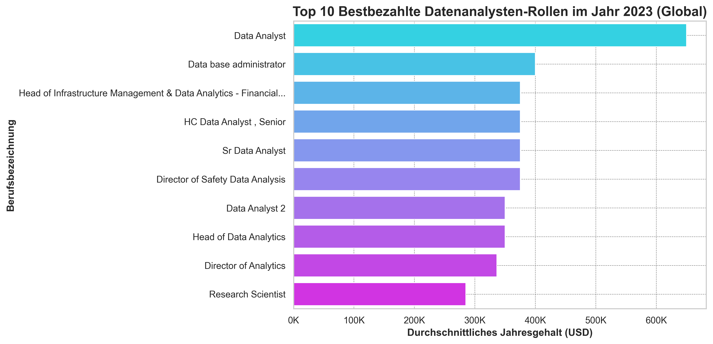
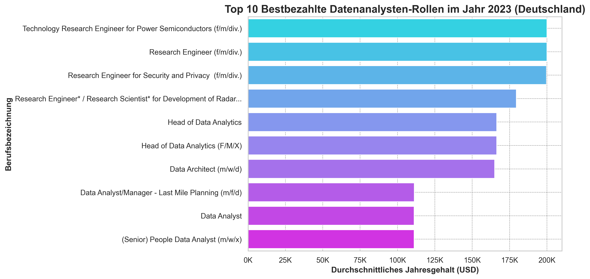
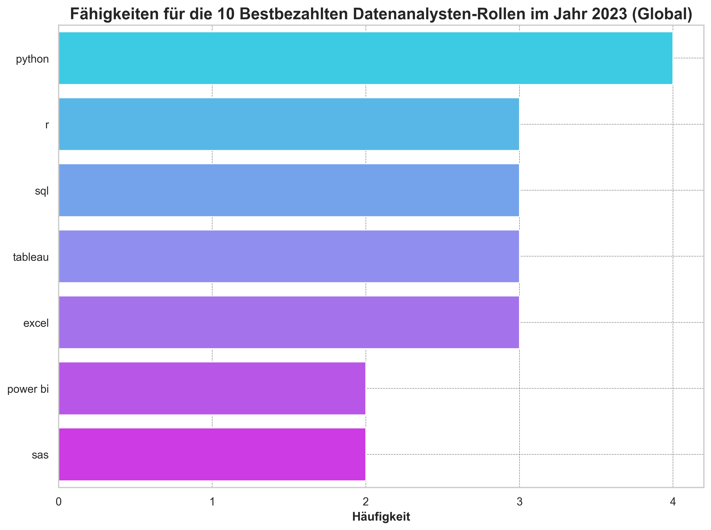
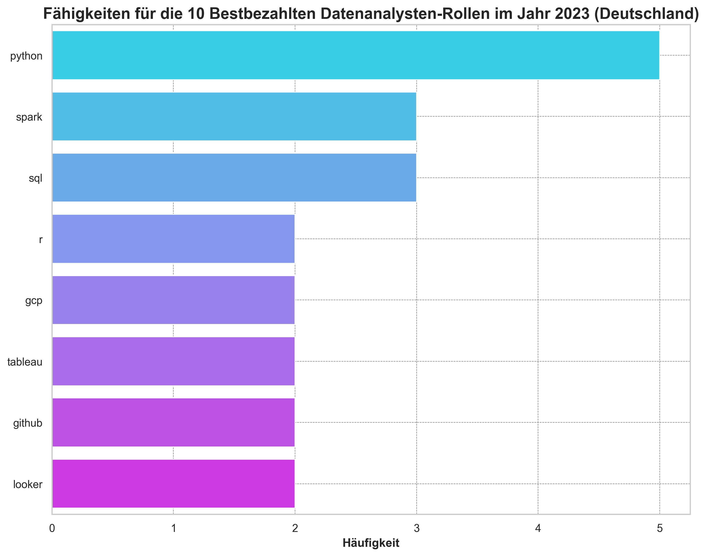
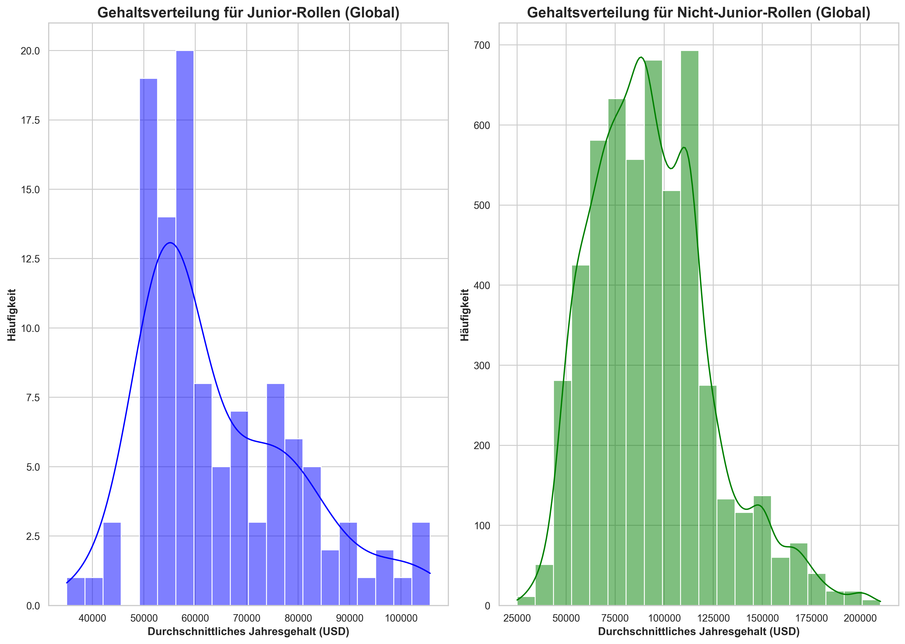
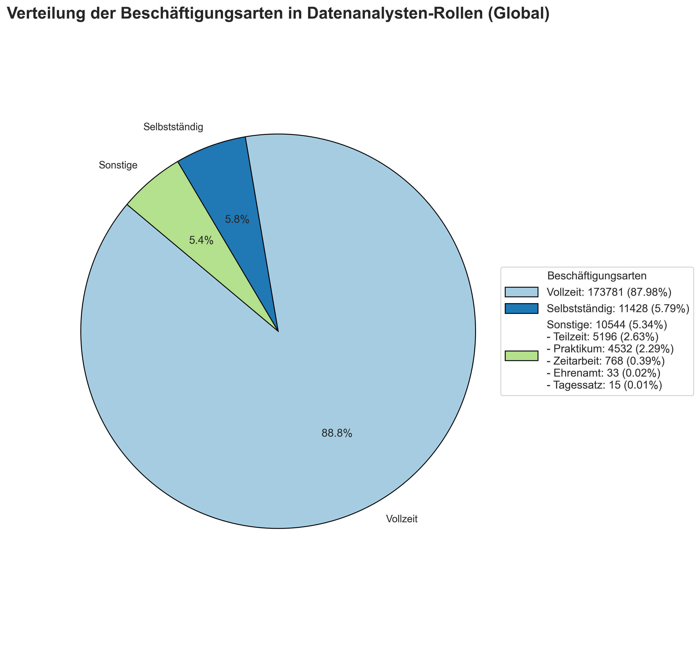
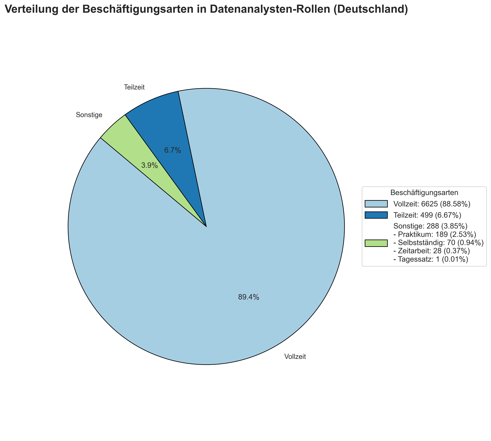
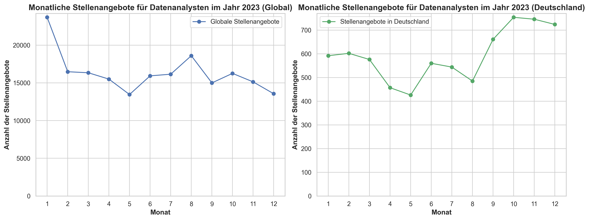

# Projekt über Datenanalyse-Jobs

[English Version here](README.md)

# Einführung
📊 Erforschen Sie den globalen und deutschen Arbeitsmarkt für Datenjobs! Dieses Projekt taucht in Datenanalysten-Rollen ein und hebt hervor: 💰 Top-bezahlte Jobs, 🔥 gefragte Fähigkeiten, 📈 Fähigkeiten, die mit höheren Gehältern verbunden sind, und 📚 die besten Fähigkeiten, die zu erlernen sind. Wir decken auch 🎓 Abschlussanforderungen, 👩‍💻 Junior-Positionen und Praktika, 🧑‍💻🏢 gängige Beschäftigungsarten und 🌍 Remote-Jobmöglichkeiten ab. Schließlich untersuchen wir, wann die Stellenangebote für Datenanalyst*innen am meisten zunehmen📅, und bieten einen umfassenden Überblick über das Gebiet.

🔍 SQL-Abfragen? Finden Sie hier: [sql_queries](/sql_queries/)

📊 Datenvisualisierung in Python? Hier: [code_for_visualizations_in_german](/code_for_visualizations_in_german.ipynb/)

# Hintergrund

**Die Wahl des richtigen Studiengangs, das Finden eines Praktikums** oder **die Suche nach Ihrer ersten Rolle im Bereich der Datenanalyse** kann sowohl aufregend als auch herausfordernd sein. In dieser Analyse möchte ich **Anfängern** wie mir helfen, den Arbeitsmarkt zu navigieren, indem ich nützliche **Einblicke in den globalen und deutschen Arbeitsmarkt für Datenanalysten** gebe.

Dieses Projekt verwendet **Daten aus Luke Barouses** [SQL-Kurs](https://lukebarousse.com/sql), der Stellenanzeigen für Data Science-Rollen weltweit im Jahr 2023 sammelt. Er bietet Einblicke in Berufsbezeichnungen, Gehälter, Standorte, Schlüsselkompetenzen und andere arbeitsbezogene Faktoren.

### Die Fragen, die ich mit meinen SQL-Abfragen beantworten wollte, waren:

1. [Was sind die bestbezahlten Datenanalysten-Jobs? 💸🌍](#1-top-bezahlte-datenanalysten-jobs)
2. [Welche Fähigkeiten sind für diese bestbezahlten Jobs erforderlich? 🎓💼](#2-fähigkeiten-für-die-bestbezahlten-jobs)  
3. [Welche Fähigkeiten sind bei Datenanalysten am meisten gefragt? 🔧🌍](#3-gefragte-fähigkeiten-für-datenanalysten)  
4. [Welche Fähigkeiten sind mit höheren Gehältern verbunden? 💰🔑](#4-fähigkeiten-basierend-auf-gehalt)  
5. [Welche Fähigkeiten sind am besten zu erlernen? 📚💡](#5-die-besten-fähigkeiten-die-man-erlernen-sollte) 
6. [Ist ein Abschluss für Datenanalysten-Rollen erforderlich? 🎓🤔](#6-ist-ein-abschluss-für-datenanalysten-rollen-erforderlich)  
7. [Wie viele Junior-Positionen und Praktika sind verfügbar und wie hoch ist ihre Bezahlung? 🎓🧑‍💻](#7-wie-viele-junior-positionen-und-praktika-sind-verfügbar-und-wie-hoch-ist-ihre-bezahlung)  
8. [Was sind die häufigsten Beschäftigungsarten in der Datenanalyse? 🧑‍💻📍](#8-was-sind-die-häufigsten-beschäftigungsarten-in-der-datenanalyse)  
9. [Wie häufig sind Remote- und Home-Office-Jobangebote in der Datenanalyse? 🌍](#9-wie-häufig-sind-remote--und-home-office-jobangebote-in-der-datenanalyse)   
10. [Wann sind die Jobangebote für Datenanalysten am häufigsten? 📅📈](#10-wann-sind-die-jobangebote-für-datenanalysten-am-häufigsten) 

# Werkzeuge, die ich verwendet habe
Für meinen tiefen Einblick in den Arbeitsmarkt für Datenanalysten habe ich mehrere wichtige Werkzeuge verwendet:

- **SQL:** Das Rückgrat meiner Analyse, mit dem ich die Datenbank abfragen und wichtige Einblicke gewinnen konnte.
- **PostgreSQL:** Das gewählte Datenbankmanagement-System, ideal für die Verarbeitung der Stellenangebotsdaten.
- **Visual Studio Code:** Mein bevorzugtes Tool für Datenbankmanagement und die Ausführung von SQL-Abfragen.
- **Git & GitHub:** Unverzichtbar für die Versionskontrolle und das Teilen meiner SQL-Skripte und Analysen, um die Zusammenarbeit und Projektverfolgung sicherzustellen.
- **Python & Jupyter Notebook:** Für das Erzählen meiner Daten-Geschichte durch ansprechende und schnell erstellte Visualisierungen.
- **ChatGPT (Plus-Abonnement):** Agierte als Datenanalyse-Co-Pilot, leitete Projektphasen, unterstützte bei wiederholenden Aufgaben wie Formatierungen und half bei datengestützten Schlussfolgerungen.

# Die Analyse
Jede Abfrage dieses Projekts zielte darauf ab, spezifische Aspekte des Arbeitsmarkts für Datenanalysten zu untersuchen. Hier ist, wie ich jede Frage angegangen bin:

### 1. Top bezahlte Datenanalysten-Jobs

Um die bestbezahlten Rollen 💰 zu identifizieren, habe ich Datenanalysten-Positionen nach dem durchschnittlichen Jahresgehalt 📅 und dem Standort 🌍 gefiltert und mich auf Jobs weltweit und in Deutschland konzentriert. Bei der Analyse des globalen Marktes wählte ich alle Länder aus, einschließlich Deutschland, um einen umfassenden Überblick über globale Trends zu erhalten. Diese Abfrage hebt die hochbezahlten Möglichkeiten im Bereich hervor.

```sql
-- Bestbezahlte Rollen weltweit mit eindeutigen Titeln

WITH RankedJobs AS (
    SELECT
        job_id,
        job_title,
        job_location,
        job_country,
        job_schedule_type,
        salary_year_avg,
        job_posted_date,
        company_dim.name AS company_name,
        ROW_NUMBER() OVER (PARTITION BY job_title ORDER BY salary_year_avg DESC) AS row_num
    FROM
        job_postings_fact
    LEFT JOIN company_dim 
        ON job_postings_fact.company_id = company_dim.company_id
    WHERE
        job_title_short = 'Data Analyst'
        AND salary_year_avg IS NOT NULL
)

SELECT
    job_id,
    CASE
        WHEN row_num > 1 THEN CONCAT(job_title, ' ', row_num) 
        ELSE job_title
    END AS new_job_title, -- Umbenennung von Einträgen mit dem gleichen Titel
    job_location,
    job_country,
    job_schedule_type,
    salary_year_avg,
    job_posted_date,
    company_name
FROM RankedJobs
ORDER BY salary_year_avg DESC
LIMIT 10;

-- Bestbezahlte Rollen in Deutschland mit eindeutigen Titeln

WITH RankedJobsGermany AS (
    SELECT
        job_id,
        job_title,
        job_location,
        job_country,
        job_schedule_type,
        salary_year_avg,
        job_posted_date,
        company_dim.name AS company_name,
        ROW_NUMBER() OVER (PARTITION BY job_title ORDER BY salary_year_avg DESC) AS row_num
    FROM
        job_postings_fact
    LEFT JOIN company_dim 
        ON job_postings_fact.company_id = company_dim.company_id
    WHERE
        job_title_short = 'Data Analyst'
        AND salary_year_avg IS NOT NULL
        AND job_country = 'Germany'
)

SELECT
    job_id,
    CASE
        WHEN row_num > 1 THEN CONCAT(job_title, ' ', row_num) 
        ELSE job_title
    END AS new_job_title, -- Umbenennung von Einträgen mit dem gleichen Titel
    job_location,
    job_country,
    job_schedule_type,
    salary_year_avg,
    job_posted_date,
    company_name
FROM RankedJobsGermany
ORDER BY salary_year_avg DESC
LIMIT 10;
```
*Balkendiagramme, die die 10 bestbezahlten Datenanalysten-Rollen im Jahr 2023 weltweit und in Deutschland zeigen, zusammen mit ihren jeweiligen Gehältern:*





Hier ist eine Übersicht der bestbestbezahlten Datenanalysten-Jobs im Jahr 2023 weltweit und in Deutschland:

**Globaler Markt:**

- **Gehaltsbereich:** Die Rollen reichen von **$285,000** bis **$650,000**, mit hochbezahlten Positionen in der Technologie- und Finanzbranche.
- **Senior-Positionen:** Hohe Nachfrage nach Führungspositionen, mit Arbeitgebern wie Citigroup und Meta, die Top-Gehälter anbieten.

**Deutschland:**

- **Gehaltsbereich:** Die Rollen reichen von **$111,175** bis **$200,000**, mit Top-Arbeitgebern wie Bosch und Fraunhofer-Gesellschaft.
- **Fokus auf Führung:** Starke Nachfrage nach Führungspositionen wie Leiter:in der Datenanalyse.

**Vergleich Global vs. Deutschland**

- **Gehaltsunterschied:** Die Gehälter weltweit sind deutlich höher, wobei globale Rollen bis zu **$650,000** erreichen, im Vergleich zu **$200,000** in Deutschland.
- **Rollenspezialisierung:** Der globale Markt tendiert zu Führungspositionen, während Deutschland stärker auf spezialisierte Ingenieur- und Technologie-Rollen fokussiert ist.

### 2. Fähigkeiten für die bestbezahlten Jobs
Lassen Sie uns tiefer in die Top 10 der bestbezahlten Datenanalysten-Jobs aus der vorherigen Abfrage eintauchen 🔍💼 und die gefragtesten Fähigkeiten für diese Rollen identifizieren. 📊 Das Wissen um diese Fähigkeiten hilft Arbeitssuchenden 🎯, sich auf das zu konzentrieren, was sie entwickeln müssen, um sich mit hochbezahlten Möglichkeiten 💸 in Einklang zu bringen.

```sql
-- weltweit, nur Zählung der Fähigkeiten

WITH count_top_paying_jobs_globally AS (
    SELECT	
        job_id,
        job_title_short,
        salary_year_avg
    FROM
        job_postings_fact
    WHERE
        job_title_short = 'Data Analyst' AND 
        salary_year_avg IS NOT NULL
    ORDER BY
        salary_year_avg DESC
    LIMIT 10
)

SELECT 
    skills_dim.skills,
    COUNT(*) AS skill_count  -- Zählen der Anzahl der Nennungen jeder Fähigkeit
FROM count_top_paying_jobs_globally
INNER JOIN skills_job_dim ON count_top_paying_jobs_globally.job_id = skills_job_dim.job_id
INNER JOIN skills_dim ON skills_job_dim.skill_id = skills_dim.skill_id
GROUP BY 
    skills_dim.skills -- Gruppierung nach Fähigkeiten, um Vorkommen zu zählen
HAVING COUNT(*) > 1 -- Nur Fähigkeiten anzeigen, die mehr als einmal genannt wurden
ORDER BY
    skill_count DESC; -- Sortierung nach Häufigkeit der Fähigkeiten in absteigender Reihenfolge
```

*Balkendiagramme, die die Häufigkeit der Fähigkeiten für die 10 bestbezahlten Jobs für Datenanalysten im Jahr 2023 weltweit und in Deutschland visualisieren:*




Hier ist eine Übersicht der meistgefragten Fähigkeiten für die 10 bestbezahlten Datenanalysten-Jobs im Jahr 2023, sowohl weltweit als auch in Deutschland:

- **Python:** Die am meisten nachgefragte Fähigkeit weltweit (4 Erwähnungen) und in Deutschland (5 Erwähnungen), zentral für die Datenanalyse.
- **SQL:** Essenziell für Datenbankmanagement und Abfragen in beiden Märkten.
- **R, Tableau, Excel:** Sehr gefragt weltweit, während **Spark, GCP, Looker, GitHub** in Deutschland prominenter sind.
- **Überschneidungen:** **Python, R, SQL** und **Tableau** sind in beiden Märkten Schlüsselqualifikationen.

### 3. Gefragte Fähigkeiten für Datenanalysten

Diese Abfrage half dabei, die Fähigkeiten zu identifizieren, die in Stellenanzeigen am häufigsten angefordert werden, und lenkte den Fokus auf Bereiche mit hoher Nachfrage 🔥.

```sql
-- weltweit
SELECT 
    skills,
    COUNT(skills_job_dim.job_id) AS demand_count
FROM job_postings_fact
INNER JOIN skills_job_dim ON job_postings_fact.job_id = skills_job_dim.job_id
INNER JOIN skills_dim ON skills_job_dim.skill_id = skills_dim.skill_id
WHERE
    job_title_short = 'Data Analyst' 
GROUP BY
    skills
ORDER BY
    demand_count DESC
LIMIT 5;

-- Deutschland
SELECT 
    skills,
    COUNT(skills_job_dim.job_id) AS demand_count
FROM job_postings_fact
INNER JOIN skills_job_dim ON job_postings_fact.job_id = skills_job_dim.job_id
INNER JOIN skills_dim ON skills_job_dim.skill_id = skills_dim.skill_id
WHERE
    job_title_short = 'Data Analyst' 
    AND job_country = 'Germany' 
GROUP BY
    skills
ORDER BY
    demand_count DESC
LIMIT 5;
```
*Tabelle der Nachfrage nach den 5 meistgefragten Fähigkeiten in Stellenanzeigen für Datenanalysten weltweit:*

|Fähigkeiten | Anzahl der Nachfrage |
|------------|----------------------|
| SQL        | 92,628               |
| Excel      | 67,031               |
| Python     | 57,326               |
| Tableau    | 46,554               |
| Power BI   | 39,468               |

*Tabelle der Nachfrage nach den 5 meistgefragten Fähigkeiten in Stellenanzeigen für Datenanalysten in Deutschland:*

|Fähigkeiten | Anzahl der Nachfrage |
|------------|----------------------|
| SQL        | 2947                 |
| Python     | 2316                 |
| Tableau    | 1370                 |
| Excel      | 1327                 |
| Power BI   | 1303                 |

Hier ist eine Übersicht der meistgefragten Fähigkeiten für Datenanalysten im Jahr 2023 weltweit und in Deutschland:

- **SQL** ist die am meisten nachgefragte Fähigkeit weltweit (92.628) und in Deutschland (2.947), was seine zentrale Rolle in der Datenanalyse in allen Märkten unterstreicht.
- **Python** folgt dicht, mit einer starken Nachfrage sowohl weltweit (57.326) als auch in Deutschland (2.316), was den wachsenden Bedarf an Programmierfähigkeiten in der Datenanalyse zeigt.
- **Tableau** ist weltweit (46.554) und in Deutschland (1.370) sehr gefragt, was die zunehmende Bedeutung von Datenvisualisierungsfähigkeiten widerspiegelt.
- **Excel** und **Power BI** sind weltweit gefragt, aber in Deutschland etwas weniger, wo mehr Wert auf Python und Tableau für fortgeschrittene Analysen gelegt wird.

### 4. Fähigkeiten basierend auf Gehalt

Die Untersuchung der durchschnittlichen Gehälter, die mit verschiedenen Fähigkeiten verbunden sind, zeigte, welche Fähigkeiten die höchsten Gehälter bieten 💰.

```sql
-- weltweit
SELECT 
    skills,
    ROUND(AVG(salary_year_avg), 0) AS avg_salary
FROM job_postings_fact
INNER JOIN skills_job_dim ON job_postings_fact.job_id = skills_job_dim.job_id
INNER JOIN skills_dim ON skills_job_dim.skill_id = skills_dim.skill_id
WHERE
    job_title_short = 'Data Analyst'
    AND salary_year_avg IS NOT NULL
GROUP BY
    skills
ORDER BY
    avg_salary DESC
LIMIT 25;

-- Deutschland
SELECT 
    skills,
    ROUND(AVG(salary_year_avg), 0) AS avg_salary
FROM job_postings_fact
INNER JOIN skills_job_dim ON job_postings_fact.job_id = skills_job_dim.job_id
INNER JOIN skills_dim ON skills_job_dim.skill_id = skills_dim.skill_id
WHERE
    job_title_short = 'Data Analyst'
    AND job_country = 'Germany'
    AND salary_year_avg IS NOT NULL
GROUP BY
    skills
ORDER BY
    avg_salary DESC
LIMIT 25;
```

*Tabelle des durchschnittlichen Gehalts für die 10 bestbezahlten Fähigkeiten für Datenanalysten weltweit:*

|Fähigkeiten | Durchschnittsgehalt ($) |
|------------|-------------------------|
| SVN        | 400,000                 |
| Solidity   | 179,000                 |
| Couchbase  | 160,515                 |
| Datarobot  | 155,486                 |
| Golang     | 155,000                 |
| MXNet      | 149,000                 |
| Dplyr      | 147,633                 |
| VMware     | 147,500                 |
| Terraform  | 146,734                 |
| Twilio     | 138,500                 |

*Tabelle des durchschnittlichen Gehalts für die 10 bestbezahlten Fähigkeiten für Datenanalysten in Deutschland:*

|Fähigkeiten| Durchschnittsgehalt ($) |
|-----------|-------------------------|
| Kafka     | 166,420                 |
| Terraform | 166,420                 |
| BigQuery  | 166,420                 |
| NoSQL     | 166,420                 |
| Redshift  | 166,420                 |
| GitHub    | 150,896                 |
| Spark     | 138,261                 |
| GCP       | 127,478                 |
| No-SQL    | 111,175                 |
| Terminal  | 111,175                 |

Hier ist eine Übersicht der Ergebnisse für die bestbezahlten Fähigkeiten für Datenanalysten in 2023 weltweit und in Deutschland:

- **Globaler Markt** bietet die bestbezahlten Rollen für spezialisierte Fähigkeiten wie **SVN** ($400,000) und **Solidity** ($179,000), was auf die Nachfrage nach Nischentechnologien hinweist.
- **Deutschland** konzentriert sich auf Cloud- und Big-Data-Tools wie **Kafka, Terraform** und **BigQuery**, mit einem durchschnittlichen Gehalt von $166,420.
- **Vergleich Global vs. Deutschland:** Der globale Markt schätzt spezialisierte, aufkommende Technologien mehr, während Deutschland mehr Wert auf grundlegende Cloud- und Big-Data-Fähigkeiten legt.
- **Gehaltseinblicke:** Die Gehälter weltweit sind für bestimmte spezialisierte Fähigkeiten höher, aber die Gehälter in Deutschland liegen bei etwa $166,420 für gefragte Fähigkeiten.

### 5. Die besten Fähigkeiten, die man erlernen sollte

Durch die Kombination von Einblicken in die Nachfrage und Gehaltsdaten hatte diese Abfrage das Ziel, Fähigkeiten zu identifizieren, die sowohl stark nachgefragt 🔥 als auch hochbezahlt 📈 sind, und bot einen strategischen Fokus für die Entwicklung von Fähigkeiten.

```sql
-- weltweit
SELECT 
    skills_dim.skill_id,
    skills_dim.skills,
    COUNT(skills_job_dim.job_id) AS demand_count,
    ROUND(AVG(job_postings_fact.salary_year_avg), 0) AS avg_salary
FROM job_postings_fact
INNER JOIN skills_job_dim ON job_postings_fact.job_id = skills_job_dim.job_id
INNER JOIN skills_dim ON skills_job_dim.skill_id = skills_dim.skill_id
WHERE
    job_title_short = 'Data Analyst'
    AND salary_year_avg IS NOT NULL
GROUP BY
    skills_dim.skill_id
HAVING
    COUNT(skills_job_dim.job_id) > 10
ORDER BY
    avg_salary DESC,
    demand_count DESC
LIMIT 25;

-- Deutschland
SELECT 
    skills_dim.skill_id,
    skills_dim.skills,
    COUNT(skills_job_dim.job_id) AS demand_count,
    ROUND(AVG(job_postings_fact.salary_year_avg), 0) AS avg_salary
FROM job_postings_fact
INNER JOIN skills_job_dim ON job_postings_fact.job_id = skills_job_dim.job_id
INNER JOIN skills_dim ON skills_job_dim.skill_id = skills_dim.skill_id
WHERE
    job_title_short = 'Data Analyst'
    AND salary_year_avg IS NOT NULL
    AND job_country = 'Germany' 
GROUP BY
    skills_dim.skill_id
HAVING
    COUNT(skills_job_dim.job_id) > 5
ORDER BY
    avg_salary DESC,
    demand_count DESC
LIMIT 25;
```

*Tabelle der optimalsten Fähigkeiten für Datenanalysten weltweit, sortiert nach Gehalt:*

|Fähigkeit ID |Fähigkeiten |Anzahl der Nachfrage |Durchschnittsgehalt ($)|
|-------------|------------|---------------------|-----------------------|
| 98          | Kafka      | 40                  | 129,999               |
| 101         | Pytorch    | 20                  | 125,226               |
| 31          | Perl       | 20                  | 124,686               |
| 99          | TensorFlow | 24                  | 120,647               |
| 63          | Cassandra  | 11                  | 118,407               |
| 219         | Atlassian  | 15                  | 117,966               |
| 96          | Airflow    | 71                  | 116,387               |
| 3           | Scala      | 59                  | 115,480               |
| 169         | Linux      | 58                  | 114,883               |
| 234         | Confluence | 62                  | 114,153               |

*Tabelle der optimalsten Fähigkeiten für Datenanalysten in Deutschland, sortiert nach Gehalt:*

| Fähigkeit ID | Fähigkeiten | Anzahl der Nachfrage | Durchschnittsgehalt ($) |
|--------------|-------------|-----------------------|--------------------------|
| 92           | Spark       | 7                     | 138,261                  |
| 1            | Python      | 18                    | 104,243                  |
| 182          | Tableau     | 13                    | 97,211                   |
| 0            | SQL         | 24                    | 93,688                   |
| 181          | Excel       | 7                     | 87,623                   |
| 5            | R           | 7                     | 81,862                   |


Hier ist eine Übersicht der optimalsten Fähigkeiten für Datenanalysten im Jahr 2023:

**Weltweit:**

- **Kafka** (40 Nennungen) und **Solidity** (20 Nennungen) führen in Echtzeit-Datenverarbeitung und Blockchain-Rollen, mit hohen Gehältern ($129,999 und $179,000, jeweils).
- **AI/ML Nachfrage:** **Pytorch** (20 Nennungen) und **TensorFlow** (24 Nennungen) spiegeln die starke Nachfrage nach KI-Fähigkeiten wider, mit Gehältern von $125,226 und $120,647.
- **Big Data & Cloud:** **Snowflake** (241 Nennungen) und **Databricks** (102 Nennungen) sind Schlüsseltechnologien in Big Data und Cloud-Computing, mit durchschnittlichen Gehältern von ca. $111,578 und $112,881.

**Deutschland:**

- **SQL** (24 Nennungen) und **Python** (18 Nennungen) dominieren mit Gehältern von $93,688 und $104,243, während **Spark** (7 Nennungen) hohes Gehalt bietet, aber eine geringere Nachfrage hat.

### 6. Ist ein Abschluss für Datenanalysten-Rollen erforderlich?

Diese Abfrage hilft weiterhin Datenanalyse-Enthusiasten, sich durch den Arbeitsmarkt zu navigieren, indem sie die Anzahl und den Prozentsatz der Stellenanzeigen für Datenanalysten berechnet, die keinen Abschluss erwähnen 🎓, sowohl weltweit als auch in Deutschland. Dies hilft Arbeitssuchenden zu entscheiden, ob sie sich auf den Erwerb eines Abschlusses oder die Verbesserung praktischer Fähigkeiten 👩‍💻 konzentrieren sollten.

```sql
SELECT
    -- Globaler Markt (kein Abschluss erwähnt)
    COUNT(CASE WHEN job_no_degree_mention = TRUE THEN 1 END) AS no_degree_required_count_global,
    -- Gesamtanzahl der Stellenanzeigen weltweit
    COUNT(*) AS total_postings_global,
    -- Prozentsatz der Stellenanzeigen ohne Abschlussangabe weltweit
    ROUND(
        (COUNT(CASE WHEN job_no_degree_mention = TRUE THEN 1 END) * 100.0) / COUNT(*), 
        0
    ) AS percentage_no_degree_global,

    -- Deutscher Markt (kein Abschluss erwähnt)
    COUNT(CASE WHEN job_country = 'Germany' AND job_no_degree_mention = TRUE THEN 1 END) AS no_degree_required_count_germany,
    -- Gesamtanzahl der Stellenanzeigen in Deutschland
    COUNT(CASE WHEN job_country = 'Germany' THEN 1 END) AS total_postings_germany,
    -- Prozentsatz der Stellenanzeigen ohne Abschlussangabe in Deutschland
    ROUND(
        (COUNT(CASE WHEN job_country = 'Germany' AND job_no_degree_mention = TRUE THEN 1 END) * 100.0) / COUNT(CASE WHEN job_country = 'Germany' THEN 1 END), 
        0
    ) AS percentage_no_degree_germany
FROM job_postings_fact
WHERE job_title_short = 'Data Analyst';
```
*Tabelle, die die Anzahl und den Prozentsatz der Stellenanzeigen für Datenanalysten zeigt, die keinen Abschluss erwähnen, sowohl weltweit als auch in Deutschland:*

| Markt        | Stellenangebote ohne Abschluss | Gesamtzahl der Stellenangebote | Prozentsatz ohne Abschluss |
|--------------|--------------------------------|-------------------------------|----------------------------|
| Global       | 76,057                         | 196,593                       | 39%                        |
| Deutschland  | 4,894                          | 7,141                         | 69%                        |

Hier ist eine Übersicht, wie viele Stellenanzeigen für Datenanalysten im Jahr 2023 weltweit und in Deutschland den Abschluss erwähnten:

- **Globaler Markt:** Während 39% der Stellenangebote für Datenanalysten weltweit keinen Abschluss erwähnen, bedeutet dies nicht unbedingt, dass er nicht erforderlich ist. Etwa 60% der Stellenanzeigen erwähnen dennoch eine Abschlussanforderung.
- **Deutschland:** Etwa 69% der Stellenangebote für Datenanalysten in Deutschland erwähnen keinen Abschluss, aber das garantiert nicht, dass er keine Rolle spielt. Rund 40% der Stellenanzeigen erwähnen nach wie vor eine Abschlussanforderung.
- **Folgerung:** Arbeitssuchende können immer noch viele Möglichkeiten ohne Abschluss finden, insbesondere in Deutschland. Es ist jedoch wichtig zu bedenken, dass Abschlussanforderungen auch dann noch gelten können, wenn sie in den Stellenanzeigen nicht ausdrücklich erwähnt werden.

### 7. Wie viele Junior-Positionen und Praktika sind verfügbar und wie hoch ist ihre Bezahlung?

Durch die Analyse von Junior-Positionen und Praktika 👩‍💻 hilft diese Abfrage angehenden Analysten, Einstiegsmöglichkeiten und Gehaltstrends weltweit und in Deutschland zu bewerten.

```sql
-- Zählen der Junior-Positionen, Praktika und deren Prozentsatz (mit NULL-Werten in der Gehalts-Spalte salary_year_avg)

SELECT
    -- Globaler Markt (Junior-Stellen)
    COUNT(CASE WHEN job_title LIKE '%Junior%' THEN 1 END) AS junior_postings_count_global,
    -- Gesamtanzahl der Stellen weltweit
    COUNT(*) AS total_postings_global,
    -- Prozentsatz der Junior-Jobangebote weltweit
    ROUND(
        (COUNT(CASE WHEN job_title LIKE '%Junior%' THEN 1 END) * 100.0) / COUNT(*), 
        0
    ) AS percentage_junior_roles_global,

    -- Globaler Markt (Praktika)
    COUNT(CASE WHEN job_schedule_type LIKE '%Internship%' THEN 1 END) AS internships_count_global,
    -- Prozentsatz der Praktikumsangebote weltweit
    ROUND(
        (COUNT(CASE WHEN job_schedule_type LIKE '%Internship%' THEN 1 END) * 100.0) / COUNT(*), 
        0
    ) AS percentage_internships_global,

    -- Deutscher Markt (Junior-Positionen)
    COUNT(CASE WHEN job_country = 'Germany' AND job_title LIKE '%Junior%' THEN 1 END) AS junior_postings_count_germany,
    -- Gesamtanzahl der Stellen in Deutschland
    COUNT(CASE WHEN job_country = 'Germany' THEN 1 END) AS total_postings_germany,
    -- Prozentsatz der Junior-Jobangebote in Deutschland
    ROUND(
        (COUNT(CASE WHEN job_country = 'Germany' AND job_title LIKE '%Junior%' 
            THEN 1 END) * 100.0) / COUNT(CASE WHEN job_country = 'Germany' THEN 1 END), 
        0
    ) AS percentage_junior_roles_germany,

    -- Deutscher Markt (Praktika)
    COUNT(CASE WHEN job_country = 'Germany' AND job_schedule_type LIKE '%Internship%' THEN 1 END) AS internships_count_germany,
    -- Prozentsatz der Praktikumsangebote in Deutschland
    ROUND(
        (COUNT(CASE WHEN job_country = 'Germany' AND job_schedule_type LIKE '%Internship%' 
            THEN 1 END) * 100.0) / COUNT(CASE WHEN job_country = 'Germany' THEN 1 END), 
        0
    ) AS percentage_internships_germany
FROM job_postings_fact
WHERE job_title_short = 'Data Analyst';

/* Zählen der Junior-Positionen, Praktika und deren Prozentsatz (ohne NULL-Werte in der salary_year_avg Spalte); 
Ergebnisse dieser Abfrage zeigen, dass nur eine weitere Analyse der Gehälter von Junior- vs. Non-Junior-Datenanalysten-Stellen im globalen Markt repräsentativ ist, aufgrund der ausreichenden Größe des Datensatzes
*/

SELECT
    -- Globaler Markt (Junior-Positionen)
    COUNT(CASE WHEN job_title LIKE '%Junior%' THEN 1 END) AS junior_postings_count_global,
    -- Gesamtanzahl der Stellen weltweit
    COUNT(*) AS total_postings_global,
    -- Prozentsatz der Junior-Jobangebote weltweit
    ROUND(
        (COUNT(CASE WHEN job_title LIKE '%Junior%' THEN 1 END) * 100.0) / COUNT(*), 
        0
    ) AS percentage_junior_roles_global,

    -- Globaler Markt (Praktika)
    COUNT(CASE WHEN job_schedule_type LIKE '%Internship%' THEN 1 END) AS internships_count_global,
    -- Prozentsatz der Praktikumsangebote weltweit
    ROUND(
        (COUNT(CASE WHEN job_schedule_type LIKE '%Internship%' THEN 1 END) * 100.0) / COUNT(*), 
        2
    ) AS percentage_internships_global,

    -- Deutscher Markt (Junior-Positionen)
    COUNT(CASE WHEN job_country = 'Germany' AND job_title LIKE '%Junior%' THEN 1 END) AS junior_postings_count_germany,
    -- Gesamtanzahl der Stellen in Deutschland
    COUNT(CASE WHEN job_country = 'Germany' THEN 1 END) AS total_postings_germany,
    -- Prozentsatz der Junior-Jobangebote in Deutschland
    ROUND(
        (COUNT(CASE WHEN job_country = 'Germany' AND job_title LIKE '%Junior%' 
            THEN 1 END) * 100.0) / COUNT(CASE WHEN job_country = 'Germany' THEN 1 END), 
        0
    ) AS percentage_junior_roles_germany,

    -- Deutscher Markt (Praktika)
    COUNT(CASE WHEN job_country = 'Germany' AND job_schedule_type LIKE '%Internship%' THEN 1 END) AS internships_count_germany,
    -- Prozentsatz der Praktikumsangebote in Deutschland
    ROUND(
        (COUNT(CASE WHEN job_country = 'Germany' AND job_schedule_type LIKE '%Internship%' 
            THEN 1 END) * 100.0) / COUNT(CASE WHEN job_country = 'Germany' THEN 1 END), 
        2
    ) AS percentage_internships_germany
FROM job_postings_fact
WHERE job_title_short = 'Data Analyst' 
AND salary_year_avg IS NOT NULL;

-- Abfrage zur Berechnung des Medians der Gehälter für Junior- und Non-Junior-Rollen, unter Analyse des globalen Marktes

WITH JuniorSalaries AS (
    SELECT salary_year_avg,
           ROW_NUMBER() OVER (ORDER BY salary_year_avg) AS row_num,
           COUNT(*) OVER () AS total_count
    FROM job_postings_fact
    WHERE job_title_short = 'Data Analyst' 
      AND job_title LIKE '%Junior%' 
      AND salary_year_avg IS NOT NULL
),
NonJuniorSalaries AS (
    SELECT salary_year_avg,
           ROW_NUMBER() OVER (ORDER BY salary_year_avg) AS row_num,
           COUNT(*) OVER () AS total_count
    FROM job_postings_fact
    WHERE job_title_short = 'Data Analyst' 
      AND job_title NOT LIKE '%Junior%' 
      AND salary_year_avg IS NOT NULL
)
SELECT 
    'Junior' AS job_type,
    ROUND(AVG(salary_year_avg), 0) AS median_salary  -- Abrunden auf null Dezimalstellen
FROM JuniorSalaries
WHERE row_num IN (
    SELECT FLOOR((total_count + 1) / 2)
    UNION ALL
    SELECT FLOOR(total_count / 2)
    UNION ALL
    SELECT FLOOR(total_count / 2) + 1
)
UNION ALL
SELECT 
    'Non-Junior' AS job_type,
    ROUND(AVG(salary_year_avg), 0) AS median_salary  -- Abrunden auf null Dezimalstellen
FROM NonJuniorSalaries
WHERE row_num IN (
    SELECT FLOOR((total_count + 1) / 2)
    UNION ALL
    SELECT FLOOR(total_count / 2)
    UNION ALL
    SELECT FLOOR(total_count / 2) + 1
);

/* Vorbereitung der Daten zur Bereinigung (Entfernen von Ausreißern) und zur Erstellung der Gehaltsverteilung von Junior- vs. Non-Junior-Datenanalysten-Stellenanzeigen in Python */

SELECT
    'Junior' AS job_type,
    salary_year_avg
FROM job_postings_fact
WHERE job_title LIKE '%Junior%' 
    AND job_title_short = 'Data Analyst' 
    AND salary_year_avg IS NOT NULL
ORDER BY salary_year_avg DESC;

SELECT
    'Non-Junior' AS job_type,
    salary_year_avg
FROM job_postings_fact
WHERE job_title_short = 'Data Analyst' 
    AND job_title NOT LIKE '%Junior%' 
    AND salary_year_avg IS NOT NULL
ORDER BY salary_year_avg DESC;
```

```python
import pandas as pd 
import seaborn as sns
import matplotlib.pyplot as plt

# Lade die Datensätze für Junior- und Nicht-Junior-Rollen weltweit
junior_df = pd.read_csv('C:\\Users\\Lenovo\\Downloads\\7_junior_postings_global.csv')
non_junior_df = pd.read_csv('C:\\Users\\Lenovo\\Downloads\\7_nonjunior_postings_global.csv')

# Funktion, um Ausreißer basierend auf der IQR-Methode zu entfernen
def remove_outliers(df, role_type):
    # Berechne Q1 (25. Perzentil) und Q3 (75. Perzentil)
    Q1 = df['salary_year_avg'].quantile(0.25)
    Q3 = df['salary_year_avg'].quantile(0.75)
    
    # Berechne IQR (Interquartilsabstand)
    IQR = Q3 - Q1
    
    # Setze den Multiplikator basierend auf dem Rollentyp
    if role_type == 'junior':
        multiplier = 1.5  # Standardmultiplikator für Junior-Rollen
    else:
        multiplier = 2.5  # Angepasster Multiplikator für Nicht-Junior-Rollen
    
    # Definiere die oberen und unteren Grenzen
    lower_bound = Q1 - multiplier * IQR
    upper_bound = Q3 + multiplier * IQR
    
    # Filtere den DataFrame, um Ausreißer zu entfernen
    filtered_df = df[(df['salary_year_avg'] >= lower_bound) & (df['salary_year_avg'] <= upper_bound)]
    
    return filtered_df

# Entferne Ausreißer für Junior-Rollen (mit 1.5 Multiplikator)
junior_df_cleaned = remove_outliers(junior_df, 'junior')

# Entferne Ausreißer für Nicht-Junior-Rollen (mit 2.5 Multiplikator)
non_junior_df_cleaned = remove_outliers(non_junior_df, 'non-junior')

# Behebe SettingWithCopyWarning, indem .loc verwendet wird, um sicherzustellen, dass der DataFrame richtig geändert wird
junior_df_cleaned.loc[:, 'job_type'] = 'Junior'
non_junior_df_cleaned.loc[:, 'job_type'] = 'Non-Junior'

# Erstelle zwei separate Histogramme für Junior- und Nicht-Junior-Rollen
plt.figure(figsize=(14, 10))

# Histogramm für Junior-Rollen
plt.subplot(1, 2, 1)  # 1 Zeile, 2 Spalten, 1. Unterdiagramm
sns.histplot(junior_df_cleaned['salary_year_avg'], kde=True, color='blue', bins=20)
plt.title('Gehaltsverteilung für Junior-Rollen (Global)', fontsize=16, fontweight="bold")
plt.xlabel('Durchschnittliches Jahresgehalt (USD)', fontsize=12, fontweight="bold")
plt.ylabel('Häufigkeit', fontsize=12, fontweight="bold")
plt.grid(True)  # Gitterlinien hinzufügen

# Histogramm für Nicht-Junior-Rollen
plt.subplot(1, 2, 2)  # 1 Zeile, 2 Spalten, 2. Unterdiagramm
sns.histplot(non_junior_df_cleaned['salary_year_avg'], kde=True, color='green', bins=20)
plt.title('Gehaltsverteilung für Nicht-Junior-Rollen (Global)', fontsize=16, fontweight="bold")
plt.xlabel('Durchschnittliches Jahresgehalt (USD)', fontsize=12, fontweight="bold")
plt.ylabel('Häufigkeit', fontsize=12, fontweight="bold")
plt.grid(True)  # Gitterlinien hinzufügen

plt.tight_layout()

# Definiere den Pfad zum "python_visualizations"-Ordner
visualizations_folder = 'python_visualizations'

# Stelle sicher, dass der Ordner existiert
if not os.path.exists(visualizations_folder):
    os.makedirs(visualizations_folder)

# Speichere das Diagramm direkt im "python_visualizations"-Ordner
plt.savefig(os.path.join(visualizations_folder, '07_gehaltsverteilung_bereinigt.png'), dpi=300, bbox_inches='tight', facecolor='white')

# Zeige das Diagramm an
plt.show()
```
*Tabelle, die die Anzahl der Junior-Rollen und Praktika in der Datenanalyse sowie deren Prozentsatz im Jahr 2023 weltweit und in Deutschland zeigt:*

| Metrik                           | Globaler Markt     | Deutscher Markt     |
|----------------------------------|--------------------|---------------------|
| **Gesamtzahl der Stellenangebote** | 196,593            | 7,141               |
| **Anzahl der Junior-Stellen**    | 5,755              | 396                 |
| **Prozentsatz der Junior-Stellen** | 3%                 | 6%                  |
| **Anzahl der Praktika**          | 4,532              | 189                 |
| **Prozentsatz der Praktika**     | 2%                 | 3%                  |

*Tabelle, die das mediane Jahresgehalt für Junior- und Non-Junior-Datenanalysten-Rollen im Jahr 2023 weltweit zeigt:*

|Berufserfahrung| Median Gehalt (USD) |
|---------------|---------------------|
| Junior        | $57,500             |
| Non-Junior    | $90,000             |

*Histogramme, die die Gehaltsverteilung von Junior- vs Non-Junior-Datenanalysten-Stellenanzeigen im Jahr 2023 weltweit zeigen:*



Hier ist eine Übersicht der Anzahl der Junior-Positionen, Praktika und deren entsprechenden Gehälter:

**Globaler Markt**: 
- **3%** der Stellenangebote sind für Junior-Datenanalysten, und **2%** sind Praktika;
- **über 99% der Praktika weltweit** haben NULL-Gehaltswerte, was die Gehaltsanalyse für Praktika unrepräsentativ macht.

**Deutschland**: 
- **6%** der Stellenangebote in Deutschland sind Junior-Rollen, und **3%** sind Praktika;
- Keine Praktikumsangebote in Deutschland hatten Gehaltsdaten, was eine Gehaltsanalyse für Praktika unmöglich macht.

**Gehaltsanalyse**: 
- Nur die Analyse der **Junior vs Non-Junior Gehälter weltweit** ist repräsentativ. Das mediane Gehalt für Junior-Datenanalysten weltweit beträgt **$57,500**, während Non-Junior-Rollen ein höheres medianes Gehalt von **$90,000** haben, was eine klare **Gehaltslücke** anzeigt.
- Basierend auf den Histogrammen haben **Junior-Rollen** ein Gehaltsband hauptsächlich zwischen $40,000 und $80,000, mit einem Höhepunkt um **$50,000-$60,000**, was auf eine Konzentration in den niedrigeren Gehaltsbereichen hinweist.
- **Non-Junior-Rollen** erstrecken sich über ein breiteres Spektrum von $25.000 bis über $200,000, mit einer Konzentration um **$60,000-$120,000**, was höhere und vielfältigere Gehaltsangebote widerspiegelt.

### 8. Was sind die häufigsten Beschäftigungsarten in der Datenanalyse?

Diese Abfrage zeigt die häufigsten Beschäftigungsarten 🧑‍💻🏢 (z. B. Vollzeit, Teilzeit, Selbstständigkeit), die den Arbeitssuchenden helfen, die beste Option für ihre Karriere und ihren Lebensstil zu wählen.

```sql
-- Vorbereitung des Datensatzes der Beschäftigungsarten auf dem globalen und deutschen Datenanalyse-Arbeitsmarkt für die weitere Verwendung in der NLP-Analyse

-- global
SELECT job_schedule_type
FROM job_postings_fact
WHERE job_title_short = 'Data Analyst' 
AND job_schedule_type IS NOT NULL;

-- Deutschland
SELECT job_schedule_type
FROM job_postings_fact
WHERE job_title_short = 'Data Analyst' 
AND job_schedule_type IS NOT NULL
AND job_country = 'Germany';
```
Der folgende Code ist nur für die Analyse des globalen Marktes; siehe [code_for_visualizations_in_german](/code_for_visualizations_in_german.ipynb) für die Analyse des deutschen Marktes.

```python 
import os 
import pandas as pd
from collections import Counter
import matplotlib.pyplot as plt
import re

# Lade den Datensatz für den globalen Markt
df_global = pd.read_csv('C:\\Users\\Lenovo\\Downloads\\08_employment_type_global.csv')

# Entferne Zeilen, bei denen 'job_schedule_type' NaN ist
df_global = df_global.dropna(subset=['job_schedule_type'])

# Schritt 1: Entferne "Pekerjaan tetap" Zeilen
df_global = df_global[df_global['job_schedule_type'] != 'Pekerjaan tetap']

# Schritt 2: Definiere mehrteilige Ausdrücke, die durch Platzhalter ersetzt werden sollen
multi_word_phrases = ['Temp work', 'Per diem']

# Schritt 3: Ersetze mehrteilige Ausdrücke durch Platzhalter, um eine Aufspaltung zu vermeiden
df_global['job_schedule_type'] = df_global['job_schedule_type'].replace({
    'Temp work': 'TEMP_WORK',
    'Per diem': 'PER_DIEM'
}, regex=False)

# Schritt 4: Teile Beschäftigungsarten durch 'and', ', ' und ', and' und zähle einzelne Komponenten
individual_components_global = []

# Iteriere über die Beschäftigungsarten und teile sie durch die angegebenen Trennzeichen
for schedule in df_global['job_schedule_type'].dropna():
    components_global = re.split(r'\s*(?:, and|and|,)\s*', schedule)  # Teile nach 'and', ', and' oder ', '
    individual_components_global.extend(components_global)

# Schritt 5: Zähle die Vorkommen jeder Komponente
component_counts_global = Counter(individual_components_global)

# Schritt 6: Ersetze Platzhalter zurück mit den korrekten mehrteiligen Ausdrücken
component_counts_global = {key.replace('TEMP_WORK', 'Zeitarbeit').replace('PER_DIEM', 'Tagessatz'): value 
                           for key, value in component_counts_global.items()}

# Schritt 7: Berechne die Gesamtfrequenz für den globalen Markt
total_frequency_global = sum(component_counts_global.values())

# Schritt 8: Gruppiere Beschäftigungsarten, die weniger als 5% ausmachen, in "Sonstige" für den globalen Markt
grouped_counts_global = {}
others_count_global = 0
others_details_global = []

# Übersetzungen Wörterbuch der Beschäftigungsarten 
job_schedule_translations = {
    'Full-time': 'Vollzeit',
    'Contractor': 'Selbstständig', 
    'Part-time': 'Teilzeit',
    'Internship': 'Praktikum',
    'Temp work': 'Zeitarbeit',
    'Volunteer': 'Ehrenamt',  
    'Per diem': 'Tagessatz',
    'Others': 'Sonstige'
}

# Schritt 9: Ersetze alle Beschäftigungsarten im DataFrame und in den Zählungen
component_counts_global_translated = {
    job_schedule_translations.get(key, key): value
    for key, value in component_counts_global.items()
}

# Schritt 10: Gruppiere die Beschäftigungsarten mit weniger als 5% in "Sonstige"
grouped_counts_global = {}
others_count_global = 0
others_details_global = []

# Identifiziere Komponenten, die in "Sonstige" gruppiert werden sollten
for job_type, count in component_counts_global_translated.items():
    percentage = (count / total_frequency_global) * 100
    if percentage < 5:
        others_count_global += count
        others_details_global.append((job_type, count, percentage))  # Speichere als Tuple mit Prozentwert zur Sortierung
    else:
        grouped_counts_global[job_type] = count

# Sortiere die "Sonstige"-Komponenten nach Häufigkeit in absteigender Reihenfolge
others_details_global.sort(key=lambda x: x[1], reverse=True)  # Sortiere nach Häufigkeit (Index 1)

# Füge die "Sonstige"-Kategorie zu den gruppierten Zählungen hinzu
if others_count_global > 0:
    grouped_counts_global[job_schedule_translations['Others']] = others_count_global

# Schritt 11: Erstelle einen DataFrame für eine bessere Visualisierung für den globalen Markt
component_df_global = pd.DataFrame(component_counts_global_translated.items(), columns=['Beschäftigungsart', 'Häufigkeit'])
component_df_global = component_df_global.sort_values(by='Häufigkeit', ascending=False)

updated_component_df_global = pd.DataFrame(grouped_counts_global.items(), columns=['Beschäftigungsart', 'Häufigkeit'])
updated_component_df_global = updated_component_df_global.sort_values(by='Häufigkeit', ascending=False)

# Berechne den Prozentsatz für jede Beschäftigungsart in der aktualisierten Tabelle für den globalen Markt
component_df_global['Prozent'] = (component_df_global['Häufigkeit'] / component_df_global['Häufigkeit'].sum()) * 100
component_df_global['Prozent'] = component_df_global['Prozent'].round(2)  # Stelle sicher, dass es 2 Dezimalstellen gibt

updated_component_df_global['Prozent'] = (updated_component_df_global['Häufigkeit'] / updated_component_df_global['Häufigkeit'].sum()) * 100
updated_component_df_global['Prozent'] = updated_component_df_global['Prozent'].round(2)  # Stelle sicher, dass es 2 Dezimalstellen gibt

# Zeige das Ergebnis als Tabelle für den globalen Markt
print("Häufigkeit der Beschäftigungsarten (Global)")
print(component_df_global)

# Zeige das Ergebnis als Tabelle für den globalen Markt
print("Aktualisierte Häufigkeit der Beschäftigungsarten (Global)")
print(updated_component_df_global)

# Schritt 12: Plotte die Ergebnisse als Kreisdiagramm für den globalen Markt
plt.figure(figsize=(10, 10))

# Kreisdiagramm für die gruppierten Daten (globaler Markt)
plt.pie(updated_component_df_global['Häufigkeit'], labels=updated_component_df_global['Beschäftigungsart'], autopct='%1.1f%%', startangle=140, 
        colors=plt.cm.Paired.colors, wedgeprops={'edgecolor': 'black'})

# Füge einen Titel für den globalen Markt hinzu
plt.title('Verteilung der Beschäftigungsarten in Datenanalysten-Rollen (Global)', fontsize=18, fontweight="bold")

# Füge eine dynamische Legende für die "Sonstige"-Kategorie mit detaillierter Aufschlüsselung für den globalen Markt hinzu
others_legend_global = "\n".join([f'- {job_type}: {count} ({percentage:.2f}%)' for job_type, count, percentage in others_details_global])
labels_global = [
    f'{key}: {value} ({value/total_frequency_global*100:.2f}%)' 
    for key, value in component_counts_global_translated.items() if (value / total_frequency_global) * 100 >= 5
] + [f'Sonstige: {others_count_global} ({others_count_global/total_frequency_global*100:.2f}%)\n{others_legend_global}']

# Erstelle die Legende mit verbesserter Lesbarkeit für "Sonstige" für den globalen Markt
plt.legend(labels_global, loc='center left', bbox_to_anchor=(1, 0.5), title="Beschäftigungsarten", fontsize=12, handlelength=3, handleheight=1)

# Zeige das Kreisdiagramm an
plt.axis('equal')  # Gleiche Aspect-Ratio stellt sicher, dass das Diagramm als Kreis gezeichnet wird.
plt.tight_layout()

# Definiere den Pfad zum "python_visualizations"-Ordner
visualizations_folder = 'python_visualizations'

# Stelle sicher, dass der Ordner existiert
if not os.path.exists(visualizations_folder):
    os.makedirs(visualizations_folder)

# Speichere das Diagramm direkt im "python_visualizations"-Ordner
plt.savefig(os.path.join(visualizations_folder, '08_beschaeftigungsarten_global.png'), dpi=300, bbox_inches='tight', facecolor='white')

# Zeige das Diagramm an
plt.show()
```
*Kreisdiagramme, die die Verteilung der Beschäftigungsarten in Datenanalyse-Stellenanzeigen weltweit und in Deutschland zeigen:*




Hier ist eine Übersicht der häufigsten Beschäftigungsarten in Datenanalyse-Stellenanzeigen im Jahr 2023:

- **Vollzeitstellen** dominieren sowohl den globalen (88,78%) als auch den deutschen (89,38%) Arbeitsmarkt für Datenanalysten.
- **Selbstständige** Rollen sind weltweit häufiger (5,84%) als in Deutschland (0,94%).
- **Teilzeitstellen** sind in Deutschland (6,73%) häufiger als weltweit (2,65%).
- **Praktika** sind in kleineren Kategorien üblich, mit 2,32% weltweit und 2,55% in Deutschland.

### 9. Wie häufig sind Remote- und Home-Office-Jobangebote in der Datenanalyse?

Diese Abfrage zeigt die Häufigkeit von Remote-Arbeit und Home-Office 💻 in Datenanalyse-Jobangeboten und hilft Analysten dabei, zu entscheiden, ob sie Remote-Möglichkeiten anvisieren sollten.

```sql
/* Die folgenden Abfragen, die nach Stellenanzeigen mit Remote-Arbeit und Home-Office-Optionen suchen, zeigen, dass Stellenanzeigen, die mit "Anywhere" (Remote-Arbeit) gekennzeichnet sind, identisch mit denen sind, die als "work-from-home" gekennzeichnet sind. Daher wird nur "Remote-Arbeit" weiter analysiert, da es die "Home-Office"-Rollen umfasst.
*/

-- global
WITH query1 AS (
    SELECT job_id, job_title, salary_year_avg
    FROM job_postings_fact
    WHERE job_location = 'Anywhere'
    AND job_title_short = 'Data Analyst'
),
query2 AS (
    SELECT job_id, job_title, salary_year_avg
    FROM job_postings_fact
    WHERE job_work_from_home IS TRUE
    AND job_title_short = 'Data Analyst'
)
SELECT 
    q1.job_id, 
    q1.job_title, 
    q1.salary_year_avg AS salary_year_avg_q1,
    q2.salary_year_avg AS salary_year_avg_q2
FROM query1 q1
FULL OUTER JOIN query2 q2
    ON q1.job_id = q2.job_id
ORDER BY q1.job_id;

-- Deutschland
WITH query1 AS (
    SELECT job_id, job_title, salary_year_avg
    FROM job_postings_fact
    WHERE job_location = 'Anywhere'
    AND job_title_short = 'Data Analyst'
    AND job_country = 'Germany'
),
query2 AS (
    SELECT job_id, job_title, salary_year_avg
    FROM job_postings_fact
    WHERE job_work_from_home IS TRUE
    AND job_title_short = 'Data Analyst'
    AND job_country = 'Germany'
)
SELECT 
    q1.job_id, 
    q1.job_title, 
    q1.salary_year_avg AS salary_year_avg_q1,
    q2.salary_year_avg AS salary_year_avg_q2
FROM query1 q1
FULL OUTER JOIN query2 q2
    ON q1.job_id = q2.job_id
ORDER BY q1.job_id;

-- Berechnung, wie häufig Remote-Arbeit und Home-Office weltweit und in Deutschland angeboten werden

SELECT
    -- Globaler Markt (Remote)
    COUNT(CASE WHEN job_location = 'Anywhere' THEN 1 END) AS remote_count_global,
    -- Gesamtanzahl der Stellen weltweit
    COUNT(*) AS total_postings_global,
    -- Prozentsatz der Remote-Jobangebote weltweit
    ROUND(
        (COUNT(CASE WHEN job_location = 'Anywhere' THEN 1 END) * 100.0) / COUNT(*), 
        0
    ) AS percentage_remote_global,

    -- Deutscher Markt (Remote)
    COUNT(CASE WHEN job_country = 'Germany' AND job_location = 'Anywhere' THEN 1 END) AS remote_count_germany,
    -- Gesamtanzahl der Stellen in Deutschland
    COUNT(CASE WHEN job_country = 'Germany' THEN 1 END) AS total_postings_germany,
    -- Prozentsatz der Remote-Jobangebote in Deutschland
    ROUND(
        (COUNT(CASE WHEN job_country = 'Germany' AND job_location = 'Anywhere' THEN 1 END) * 100.0) / COUNT(CASE WHEN job_country = 'Germany' THEN 1 END), 
        0
    ) AS percentage_remote_germany
FROM job_postings_fact
WHERE job_title_short = 'Data Analyst';
```

*Tabelle, die die Anzahl der Remote- und Home-Office-Angebote in der Datenanalyse und deren Prozentsatz im Jahr 2023 weltweit und in Deutschland zeigt:*

|**Region**|**Remote-Anzahl**|**Gesamtzahl der Stellen**|**Prozentsatz Remote**|
|---------------|------------------|--------------------|-----------------------|
| Global        | 13,331           | 196,593            | 7%                    |
| Deutschland   | 274              | 7,141              | 4%                    |

Hier ist eine Übersicht der Häufigkeit von Remote- und Home-Office-Jobangeboten:

- Remote- und Home-Office-Jobangebote in der Datenanalyse sind **weltweit häufiger** (7%) **als in Deutschland** (4%).

### 10. Wann sind die Jobangebote für Datenanalysten am häufigsten?

Diese Abfrage zeigt, wann die Stellenangebote für Datenanalysten ihren Höhepunkt erreichen und hilft Arbeitssuchenden, ihre Bewerbungen zeitlich so zu planen, dass sie maximale Wirkung erzielen.

```sql
SELECT 
    EXTRACT(MONTH FROM job_posted_date) AS month,
    COUNT(CASE WHEN job_country = 'Germany' THEN job_id END) AS number_of_postings_germany,
    COUNT(job_id) AS number_of_postings_global
FROM job_postings_fact
WHERE job_title_short = 'Data Analyst'
AND EXTRACT(YEAR FROM job_posted_date) = 2023
GROUP BY month
ORDER BY month;
```
*Diagramme, die monatliche Stellenangebote für Datenanalysten im Jahr 2023 weltweit und in Deutschland zeigen:*



Hier ist eine Übersicht der monatlichen Stellenangebote für Datenanalysten im Jahr 2023 weltweit und in Deutschland:

- **Januar** sticht weltweit als der **höchste** Monat für Stellenangebote hervor, wahrscheinlich aufgrund der erhöhten Einstellungsaktivitäten der Unternehmen im neuen Jahr.
- **Oktober** ist der **Höchstmonat** in Deutschland, was auf einen starken Schub in Richtung Jahresend-Einstellungen hindeutet, möglicherweise beeinflusst durch die organisatorischen Bedürfnisse für das vierte Quartal.
- Beide Regionen verzeichneten einen bemerkenswerten **Rückgang im Dezember**, was auf eine übliche Verlangsamung der Rekrutierungsbemühungen aufgrund von Feiertagen und Jahresend-Budgetzyklen hindeutet.

# Was ich gelernt habe

Im Verlauf dieses Projekts habe ich meine Fähigkeiten in SQL, Python, NLP und AI-Prompting mit leistungsstarken Techniken und Werkzeugen ausgestattet:

🧩 **Komplexe Abfragen erstellen**: Ich habe fortgeschrittenes SQL gemeistert, indem ich Tabellen mit JOIN zusammengeführt und WITH-Klauseln für Common Table Expressions (CTEs) verwendet habe.

📊 **Datenaggregation**: Ich habe `GROUP BY` perfektioniert und `COUNT()`, `AVG()`, `ROUND()` sowie bedingte Aggregation mit `CASE` zu meinen bevorzugten Werkzeugen gemacht, um Daten zusammenzufassen.

🔢 **Sequenzgenerierung**: Ich habe `ROW_NUMBER()` verwendet, um das Mediangehalt zu berechnen und Stellenanzeigen zu bereinigen, indem ich identische Jobtitel umbenannt habe, um eine reibungslose Visualisierung zu ermöglichen.

📊 **Ausreißer entfernen**: Ich habe die IQR-Methode angewendet, um Ausreißer zu entfernen und so saubere Daten für Histogramme zu gewährleisten.

🧩 **AI Copilot**: Ich habe Prompt Engineering für Datenbereinigung und Visualisierung gemeistert, wobei ChatGPT Plus mein zuverlässiger AI-Begleiter war.

🧩 **Verarbeitung natürlicher Sprache (NLP)**: Ich habe mit Tokenisierung und der Aufteilung durch Trennzeichen gearbeitet, während ich Platzhalter für mehrteilige Ausdrücke verwendet habe, um Textfrequenzen genau zu zählen.

🔄 **Dynamisches Gruppieren & Visualisierung**: Ich habe Beschäftigungsarten unter 5% in "Sonstige" gruppiert, um klarere Kreisdiagramme zu erstellen, mit einer detaillierten Aufschlüsselung in der Legende, während ich dynamische Aktualisierungen für Prozentsätze und Diagramme basierend auf Änderungen im Datensatz sicherstellte.

💡 **Analytische Zauberei**: Ich habe Fragen in umsetzbare SQL-Abfragen und Python-Visualisierungen verwandelt und damit meine Problemlösungsfähigkeiten auf das nächste Level gebracht.

# Schlussfolgerungen

### Einblicke
Aus der Analyse sind mehrere allgemeine Erkenntnisse hervorgegangen:

1. **Top-bezahlte Datenanalysten-Jobs 💸🌍**
    - **Global** reichen die Gehälter von **285,000$** bis **650,000$**, hauptsächlich in den Bereichen Technik und Finanzen.
    - **Deutschland**: die Gehälter reichen von **111,175$** bis **200,000$**, mit einem Fokus auf Führungspositionen.

2. **Fähigkeiten für Top-bezahlte Jobs 🎓💼**
    - **Top-Fähigkeiten**: **Python, SQL, R, Tableau** und **Spark** (Deutschland) sind entscheidend für hochbezahlte Positionen.

3. **Gefragte Fähigkeiten für Datenanalysten 🔧🌍**
    - **Meist nachgefragte**: **SQL** und **Python** sind zentral in allen Märkten.

4. **Fähigkeiten basierend auf Gehalt 💰🔑**
    - **Global**: Nischenfähigkeiten wie **SVN** und **Solidity** zahlen am höchsten.
    - **Deutschland**: Big-Data-Tools wie **Kafka** und **Terraform** sind gefragt.

5. **Die optimalsten Fähigkeiten zum Lernen 📚💡**
    - **Global**: **Kafka**, **Solidity** und **AI/ML**-Tools wie **Pytorch** und **TensorFlow**.
    - **Deutschland**: **SQL** und **Python** sind die gefragtesten Fähigkeiten, während **Spark** ein hohes Gehalt bietet, aber weniger nachgefragt wird.

6. **Ist ein Abschluss für Datenanalysten-Jobs erforderlich? 🎓🤔**
    - **Global**: 39% der Stellen erwähnen keinen Abschluss, auch wenn dieser möglicherweise dennoch erforderlich ist.
    - **Deutschland**: 69% der Stellen erwähnen keinen Abschluss, auch wenn dieser möglicherweise dennoch erforderlich ist.

7. **Wie viele Junior-Positionen und Praktika sind verfügbar und wie hoch ist deren Gehalt? 🎓🧑‍💻**
    - **Global**: 3% Junior-Rollen, 2% Praktika mit einem Median-Gehalt von **57.500 $** für Junior-Positionen.
    - **Deutschland**: 6% Junior-Rollen, 3% Praktika, Gehaltsdaten nicht verfügbar.

8. **Was sind die häufigsten Beschäftigungsarten in der Datenanalyse? 🧑‍💻📍**
    - **Global**: 88% Vollzeitstellen, 5,8% Selbstständige.
    - **Deutschland**: 89% Vollzeit, 6,7% Teilzeit.

9. **Wie häufig sind Remote- und Home-Office-Jobangebote in der Datenanalyse? 🌍**
    - **Global**: 7% der Stellen sind Remote- oder Home-Office-Positionen.
    - **Deutschland**: 4% Remote- oder Home-Office-Stellen.

10. **Wann sind die Stellenangebote für Datenanalysten am häufigsten? 📅📈**
    - **Global**: Höchster Peak im **Januar**.
    - **Deutschland**: Höchster Peak im **Oktober**, mit einem Rückgang im Dezember.

### Abschließende Gedanken
Dieses Projekt hat meine SQL-, Python-, NLP- und AI-Prompting-Fähigkeiten erheblich gestärkt und mir ein tieferes Verständnis des Arbeitsmarktes für Datenanalysten weltweit und in Deutschland vermittelt. Die aus der Analyse gewonnenen Erkenntnisse bieten wertvolle Orientierung für Neueinsteiger*innen und helfen ihnen, wesentliche Fähigkeiten zu priorisieren und ihre Jobstrategien zu optimieren. Indem sie sich auf gefragte Fähigkeiten konzentrieren und Markttrends verstehen, können aufstrebende Datenanalysten besser durch ein wettbewerbsintensives Feld navigieren. Diese Erfahrung unterstreicht die Notwendigkeit für kontinuierliches Wachstum, Anpassungsfähigkeit und die Notwendigkeit, sich über neue Werkzeuge und Techniken in der Datenanalyse auf dem Laufenden zu halten.
